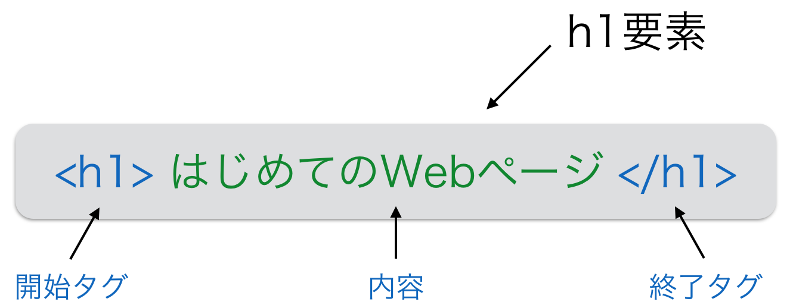

HTML5の基礎
============

## HTMLタグ
1.3 はじめてのWebページで見たように、HTMLでは`<title>`のように`<`と`>`で囲まれた「HTMLタグ」と呼ばれるものが多く現れます。
HTMLはタグによって定義されるHTML要素(HTML element)の集合で構成されます。

(1.3で作った`index.html`)

```html
<!DOCTYPE html>
<html>
  <head>
    <meta charset="utf-8">
    <title>はじめてのWebページ</title>
  </head>
  <body>
    <h1>はじめてのWebページ</h1>
    <p>はじめてのWebページです！わーい</p>
  </body>
</html>
```

要素は次の図のように開始タグ、内容、終了タグの3つから成り立っています。



`<`と`>`で囲まれた文字列を要素名といいます。
終了タグは要素名を`</`と`>`で囲んだものになります。
内容は、開始タグと要素タグで囲んだ文字列です。
開始タグ〜終了タグの全体で「要素」といいます。
`<h1>はじめてのWebページ</h1>`の場合だと「h1要素」といいます。

空要素と呼ばれる要素もあり、内容と終了タグがありません。上の`index.html`では

```html
<meta charset="utf-8">
```

がそれに当たります。

## 属性
## 空白文字
## タグによる木構造
## Webページの基本構成
## 基本的なタグ
### html
### head
### body