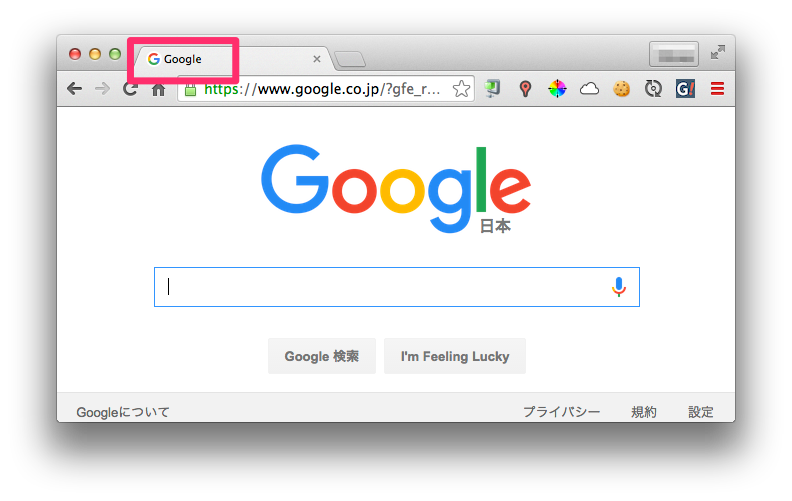

HTML5の基礎
============

## 概要
HTML5の基礎について学びます。

* HTMLタグ
* 属性
* 空白文字
* タグの親子関係
* 要素の木構造
* Webページの基本構成

## HTMLタグ
1.3 はじめてのWebページで見たように、HTMLでは`<title>`のように`<`と`>`で囲まれた「HTMLタグ」と呼ばれるものが多く現れます。
HTMLはタグによって定義されるHTML要素(HTML element)の集合で構成されます。

(1.3で作った`index.html`)

```html
<!DOCTYPE html>
<html>
  <head>
    <meta charset="utf-8">
    <title>はじめてのWebページ</title>
  </head>
  <body>
    <h1>はじめてのWebページ</h1>
    <p>はじめてのWebページです！わーい</p>
  </body>
</html>
```

要素は次の図のように開始タグ、内容、終了タグの3つから成り立っています。


`<`と`>`で囲まれた文字列を要素名といいます。
終了タグは要素名を`</`と`>`で囲んだものになります。
内容は、開始タグと要素タグで囲んだ文字列です。
開始タグ〜終了タグの全体で「要素」といいます。
`<h1>はじめてのWebページ</h1>`の場合だと「h1要素」といいます。

空要素と呼ばれる要素もあり、内容と終了タグがありません。上の`index.html`では

```html
<meta charset="utf-8">
```

がそれに当たります。

## 属性
HTMLでは要素に情報を追加するために「属性(attribute)」を使うことができます。`<meta charset="utf-8">`の`charset="utf-8"`が属性です。

属性は開始タグか空要素の要素名の後ろに「`属性名="属性値"`」と書きます。
要素名との間には半角スペースが必要です。


次のように半角スペースで区切ることで複数指定することもできます。

```html
<a href="./profile.html" target="_blank">自己紹介</a>
```

## 空白文字
ブラウザはHTMLの空白文字を無視します。空白文字とは、

* 半角スペース
* タブ
* 改行

などです。
全角スペースは空白文字ではないので注意してください。

例えば、ブラウザ的に次の3つのHTMLは同じ意味です。

```html
<body>
  <h1>自己紹介</h1>
  <section>
    <h2>なまえ</h2>
    <p>なまえはほげほげです。</p>
  </section>
</body>
```

```html
<body><h1>自己紹介</h1><section><h2>なまえ</h2></section></body>
```

```html
<body>            <h1>自己紹介


</h1><section><h2>なまえ</h2>
</section>


             </body>
```

基本は見やすくなるように適切にスペースや改行をいれていきます。

## タグの親子関係
HTMLタグには親子関係があります。
例えば次のHTMLでは、`section`要素は`h2`要素と`p`要素の「親要素」といいます。

```html
<section>
  <h2>なまえ</h2>
  <p>なまえはほげほげです。</p>
</section>
```

また、同じように`h2`要素と`p`要素を`section`要素の「子要素」といいます。
`h2`と`p`要素はお互いに「兄弟要素」であるともいいます。

ブラウザに表示される時も親子関係は維持されていて、このHTMLは内部で次のようにレンダリングされています。


## 要素の木構造
HTML文書全体でみると全ての要素に親子関係がなりたっています。
この親子関係を木構造で表現することができます。

木構造とは、親要素が複数の子要素を持ち、その子要素もさらに子要素を持ち、というように親子関係が連なってできるデータ構造のことです。
木構造では一番最初の親要素のことを根(root)要素といいます。
すべての要素は根要素から子要素を辿って行くと見つけることができます。

例えば次のHTMLをみてください。

```html
<html>
  <head>
    <meta charset="utf-8">
    <title>はじめてのWebページ</title>
  </head>
  <body>
    <h1>自己紹介</h1>
    <section>
      <h2>なまえ</h2>
      <p>なまえはほげほげです。</p>
    </section>
  </body>
</html>
```

このHTMLは親子関係を辿って行くことで次のような木構造で表現できます。


HTML文書は必ず木構造で表現できる必要があります。
次のように開始タグと終了タグが互い違いになっているようなものは木構造で表現できないためHTMLではありません。

```html
<section>
  <h2>なまえ
    <p>なまえはほげほげです。
  </h2>
    </p>
</section>
```

木構造や親子関係はCSSでデザインするときにとても重要になります。

## Webページの基本構成
Webページ(HTML文書)を構成するもっとも基本的なHTMLをみてみましょう。
1.3 はじめてのWebページで作ったものです。

```html
<!DOCTYPE html>
<html>
  <head>
    <meta charset="utf-8">
    <title>はじめてのWebページ</title>
  </head>
  <body>
    <h1>はじめてのWebページ</h1>
    <p>はじめてのWebページです！わーい</p>
  </body>
</html>
```

### 文書型宣言
HTML文書の先頭行では文書型を宣言します。
HTML5の宣言は次のようになります。

```
<!DOCTYPE html>
```

HTML5の文書にはこれを必ず先頭に書くとおぼえておいてください。

他の例だとHTML4.01では次のようになります。

```
<!DOCTYPE HTML PUBLIC "-//W3C//DTD HTML 4.01//EN">
```

### html要素
HTML文書を木構造とみたときに必ず根要素となる要素です。
他のすべてのタグは必ず`html`要素の中に入ります。

### head要素
HTML文書のメタデータを記述するための要素です。
メタデータとはタイトルや作者、要約など文書の付加的な情報のことです。

メタデータなので`head`要素の内容がブラウザで表示されることはありません。

`head`要素に最低限必要な要素は`title`要素と、文字コードを指定する`meta`要素です。

CSSを使うときも`head`要素にどのCSSファイルを使うかといったことを記述することになります。

### meta要素
文書のメタデータを記述するための要素です。
その中でも文字コードを指定する`meta`要素は必ず記述する必要があります。
文字コードとはアルファベットやひらがな、漢字などの文字をどうやってコンピュータで表現するかを定めたものです。文字コードの指定がうまくできていないと文字化けしたりすることがあります。

インターネットの標準であるUTF-8という文字コードを使う場合は次のように書きます。

```html
<meta charset="utf-8">
```

特に理由がない限りUTF-8を使えばOKです。

他のメタデータとしては次のようなものがあります。

```html
<meta name="author" content="nownabe">
<meta name="keyword" content="HTML5,CSS3">
```

`author`はその文書の著者を表し、`keyword`はその文書の特徴を表すキーワードを表します。

### title要素
Webページのタイトルを記述する要素です。
ブラウザのタイトルバーに表示されるのもこの要素の内容になります。

```html
<title>Google</title>
```




### body要素
`body`要素は文書の内容を記述します。
実際にブラウザでレンダリングされる画面も`body`要素の内容です。