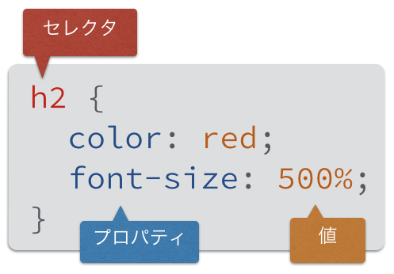

CSSでデザインする
==================

## 概要
CSSの基本を学びます。
CSSの細かい内容は省略するので、必要なときに[リファレンスサイト](http://www.htmq.com/css3/)などを参照してください。

* はじめてのCSS
* CSSの書き方
* セレクタ
* スタイルの継承
* ボックス

## はじめてのCSS
まずCSSがどんなものかを体感するため、CSSファイルを作成して1.3 はじめてのWebページで作った`profile.html`のデザインをしてみましょう。

テキストエディタを開いて新しいファイルを作成してください。

つぎのように入力して、`lestudy/html`フォルダに`style.css`というファイル名で保存してください。

```css
h2 {
  color: red;
  font-size: 500%;
}
```

次に`profile.html`から`style.css`を読み込むように設定します。
`profile.html`を開いてください。

`profile.html`では`head`要素の中で`link`要素を使ってCSSファイルを指定します。

```html
<!DOCTYPE html>
<html>
  <head>
    <meta charset="utf-8">
    <title>自己紹介</title>
    <link rel="stylesheet" href="style.css">
  </head>
  <body>
    (省略)
  </body>
</html>
```

上書き保存して、ブラウザで`profile.html`を開いてみましょう。
`h2`の見出しが赤く大きくなっていると思います。

## 基本的な書き方
CSSでは下の図のようなデザインの定義をいくつも並べて書いていきます。



セレクタとはどの要素にスタイルを適用するかを表します。
プロパティはスタイルの種類です。
プロパティに値を設定することで、背景色や文字色、大きさなどを変えることができます。

同じ要素に複数のプロパティを設定する場合はセミコロン`;`で区切って書きます。

セレクタの直後の`{}`で囲ってあるプロパティ群がそのセレクタに適用されます。

HTMLと同様に空白文字は無視されます。

## セレクタ
セレクタには様々な書き方があります。

### タイプセレクタ
単純に要素を指定することができます。
次のように書くと、全`p`要素の文字色が`red`になります。

```css
p {
  color: red;
}
```

### classセレクタ
HTMLには全要素に`class`属性をつけることができます。
ある特定の`class`属性にスタイルを設定する場合、クラス名にドットをつけたものをセレクタにします。

次のようなHTMLで趣味の`p`要素だけ文字を赤くしたい場合、タイプセレクタを使用すると特技の`p`要素も赤くなってしまいます。

```html
<h2>趣味</h2>
<p>読書です。</p>
<p>でもプログラミングはもっとすきです。</p>

<h2>特技</h2>
<p>ギターと皿回しです。</p>
```

そこで、`class`属性を追加してクラスセレクタでスタイルを定義します。

```html
<h2>趣味</h2>
<p class="hobby">読書です。</p>
<p class="hobby">でもプログラミングはもっとすきです。</p>

<h2>特技</h2>
<p class="skill">ギターと皿回しです。</p>
```

CSSは次のようになります。

```css
.hobby {
  color: red;
}
```

クラスはどの要素にもつけることができます。
例えば、このようなHTMLも可能です。

```html
<p class="hobby">読書好きです</p>
<ul>
  <li class="hobby">Ruby</li>
  <li class="hobby">JavaScript</li>
</ul
```

このような場合で`hobby`クラスの`p`要素だけにスタイルを適用したい場合は次のように書けます。

```css
p.hobby { color: red; }
```

### idセレクタ
classセレクタと似たようなセレクタにidセレクタがあります。
こちらは`id`属性を使用します。
CSSではドットではなくシャープ`#`をつけます。

`id`属性は`class`属性と違い複数の要素に同じidをつけることができません。

```html
<section id="hobby">
  <h2>趣味</h2>
  <p>読書とプログラミング</p>
</section>

<section id="skill">
  <h2>特技</h2>
  <p>さらまわし</p>
</section>
```
  
これに対応するCSSは次のようになります。

```css
#hobby { ... }
#skill { ... }
```

`id`属性はその名の通り要素の識別子として使われます。
そのため、要素の意味を表す名前をつけるようにしてください。

## スタイルの継承


## ボックス