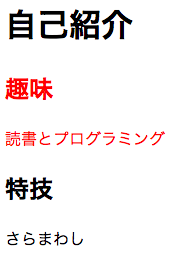
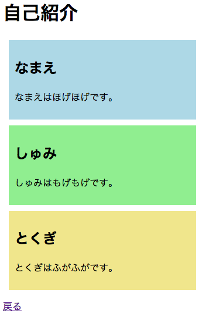
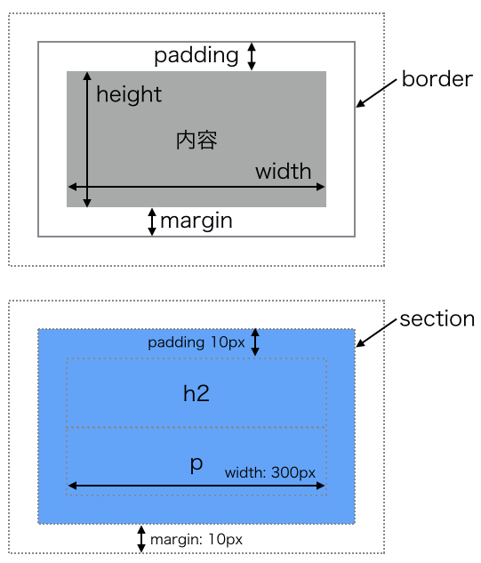
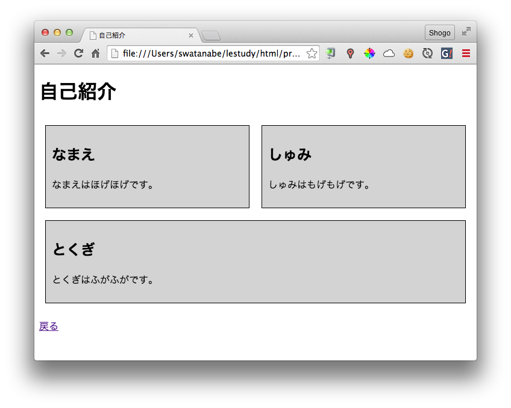
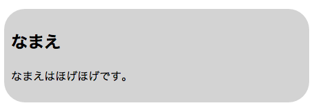
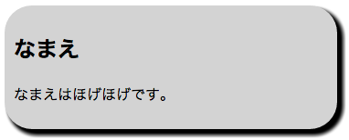

CSSでデザインする
==================

## 概要
CSSの基本を学びます。
CSSの細かい内容は省略するので、必要なときに[リファレンスサイト](http://www.htmq.com/css3/)などを参照してください。

* はじめてのCSS
* CSSの書き方
* セレクタ
* スタイルの継承
* ボックス
* flexボックス
* サイズの指定
* さまざまなプロパティ

## はじめてのCSS
まずCSSがどんなものかを体感するため、CSSファイルを作成して1.3 はじめてのWebページで作った`profile.html`のデザインをしてみましょう。

テキストエディタを開いて新しいファイルを作成してください。

つぎのように入力して、`lestudy/html`フォルダに`style.css`というファイル名で保存してください。

```css
h2 {
  color: red;
  font-size: 500%;
}
```

次に`profile.html`から`style.css`を読み込むように設定します。
`profile.html`を開いてください。

`profile.html`では`head`要素の中で`link`要素を使ってCSSファイルを指定します。

```html
<!DOCTYPE html>
<html>
  <head>
    <meta charset="utf-8">
    <title>自己紹介</title>
    <link rel="stylesheet" href="./style.css">
  </head>
  <body>
    (省略)
  </body>
</html>
```

上書き保存して、ブラウザで`profile.html`を開いてみましょう。
`h2`の見出しが赤く大きくなっていると思います。

## 基本的な書き方
CSSでは下の図のようなデザインの定義をいくつも並べて書いていきます。


セレクタとはどの要素にスタイルを適用するかを表します。
プロパティはスタイルの種類です。
プロパティに値を設定することで、背景色や文字色、大きさなどを変えることができます。

同じ要素に複数のプロパティを設定する場合はセミコロン`;`で区切って書きます。

セレクタの直後の`{}`で囲ってあるプロパティ群がそのセレクタに適用されます。

HTMLと同様に空白文字は無視されます。

## セレクタ
セレクタには様々な書き方があります。

### タイプセレクタ
単純に要素を指定することができます。
次のように書くと、全`p`要素の文字色が`red`になります。

```css
p {
  color: red;
}
```

### classセレクタ
HTMLには全要素に`class`属性をつけることができます。
ある特定の`class`属性にスタイルを設定する場合、クラス名にドットをつけたものをセレクタにします。

次のようなHTMLで趣味の`p`要素だけ文字を赤くしたい場合、タイプセレクタを使用すると特技の`p`要素も赤くなってしまいます。

```html
<h2>趣味</h2>
<p>読書です。</p>
<p>でもプログラミングはもっとすきです。</p>

<h2>特技</h2>
<p>ギターと皿回しです。</p>
```

そこで、`class`属性を追加してクラスセレクタでスタイルを定義します。

```html
<h2>趣味</h2>
<p class="hobby">読書です。</p>
<p class="hobby">でもプログラミングはもっとすきです。</p>

<h2>特技</h2>
<p class="skill">ギターと皿回しです。</p>
```

CSSは次のようになります。

```css
.hobby {
  color: red;
}
```

クラスはどの要素にもつけることができます。
例えば、このようなHTMLも可能です。

```html
<p class="hobby">読書好きです</p>
<ul>
  <li class="hobby">Ruby</li>
  <li class="hobby">JavaScript</li>
</ul
```

このような場合で`hobby`クラスの`p`要素だけにスタイルを適用したい場合は次のように書けます。

```css
p.hobby { color: red; }
```

### idセレクタ
classセレクタと似たようなセレクタにidセレクタがあります。
こちらは`id`属性を使用します。
CSSではドットではなくシャープ`#`をつけます。

`id`属性は`class`属性と違い複数の要素に同じidをつけることができません。

```html
<section id="hobby">
  <h2>趣味</h2>
  <p>読書とプログラミング</p>
</section>

<section id="skill">
  <h2>特技</h2>
  <p>さらまわし</p>
</section>
```
  
これに対応するCSSは次のようになります。

```css
#hobby { ... }
#skill { ... }
```

`id`属性はその名の通り要素の識別子として使われます。
そのため、要素の意味を表す名前をつけるようにしてください。

## スタイルの継承
CSSのスタイルは親要素から子要素へ継承されます。
例えば次のようなHTMLとCSSがあった場合、`section#hobby`要素の子要素である`h2`要素と`p`要素にもスタイルが引き継がれて文字が赤くなります。

```html
<h1>自己紹介</h1>
<section id="hobby">
  <h2>趣味</h2>
  <p>読書とプログラミング</p>
</section>

<section id="skill">
  <h2>特技</h2>
  <p>さらまわし</p>
</section>
```

```css
section#hobby { color: red; }
```



継承は子要素からさらにその子の孫要素にも引き継がれます。

## ボックス
ブラウザはHTMLのそれぞれの要素をボックスとしてレンダリングしています。

`style.css`を次のようにしてみてください。
保存してブラウザで確認するとボックスの様子が確認できます。
(`*`はユニバーサルセレクタといってすべての要素に適用されます)

```css
* { border: 1px solid blue; }
```

CSSではボックスを駆使してレイアウトしていくことになります。
例えば次のようなHTML/CSSでボックスにスタイルを適用してみます。

```html
<h1>自己紹介</h1>

<section id="name">
  <h2>なまえ</h2>
  <p>なまえはほげほげです。</p>
</section>

<section id="hobby">
  <h2>しゅみ</h2>
  <p>しゅみはもげもげです。</p>
</section>

<section id="skill">
  <h2>とくぎ</h2>
  <p>とくぎはふがふがです。</p>
</section>

<footer>
  <p><a href="./index.html">戻る</a></p>
</footer>
```

```css
section {
  width: 300px;
  margin: 10px;
  padding: 10px;
}

#name  { background-color: lightblue }
#hobby { background-color: lightgreen }
#skill { background-color: khaki }
```

結果はこんな感じです。



ボックスは次の図のように、`width`、`height`、`margin`、`padding`、`border`などのプロパティでスタイルを定義することができます。下の図は上のHTMLの例です。



## flexボックス
flexボックスを使うと簡単にレスポンシブなレイアウトを実現することができます。
実際にやってみましょう。

`profile.html`を開いて、すべての`section`要素を`section#content`で囲んでください。

```html
<div id="content">
  <section id="name">
    <h2>なまえ</h2>
    <p>なまえはほげほげです。</p>
  </section>

  <section id="hobby">
    <h2>しゅみ</h2>
    <p>しゅみはもげもげです。</p>
  </section>

  <section id="skill">
    <h2>とくぎ</h2>
    <p>とくぎはふがふがです。</p>
  </section>
</div>
```

`div`はひとかたまりな範囲を表す汎用的な要素です。

次に、`style.css`を開いてください。
Chrome, Firefox, IEの方は次のようにしてください。
(IEはIE10移行なら対応してるらしい(未確認))

```css
#content {
  display: flex;
  flex-wrap: wrap;
}

section {
  flex: 1 0 300px;
  margin: 10px;
  padding: 10px;
  border: 1px solid black;
  background-color: lightgrey;
}
```

Safariの方は次のようにしてください。

```css
#content {
  display: -webkit-flex;
  -webkit-flex-wrap: wrap;
}

section {
  -webkit-flex: 1 0 300px;
  margin: 10px;
  padding: 10px;
  border: 1px solid black;
  background-color: lightgrey;
}
```

両ファイルを保存してブラウザで開いてみてください。
ブラウザの幅を変えてみるとボックスがフレキシブルに配置されるのが確認できます。
これがflexボックスです。



flexボックスは次のようにして使います。

* フレキシブルにする要素を囲む要素に`display: flex`を設定する
* 囲む要素に`flex-wrap: wrap`をすると、ブラウザ幅が小さくなったときに自動で折り返す
* フレキシブルにする要素に伸び率、縮み率、基準幅を設定する: `flex: <伸び率> <縮み率> <基準幅>`

flexボックスは最近注目されている技術なので是非flexボックスを使ってレイアウトしてみてください。

## サイズの指定
これまで`px`や`%`などのサイズの指定がでましたが、他にも様々なものがあります。

### 相対単位
他の何かのサイズを基準にして長さを決める。

* 1em: 親要素の文字サイズ (2 emなら親要素の文字の2倍になる)
* 1rem: ルート要素の文字サイズ
* 1px: ディスプレイの1画素

など

### 絶対単位
絶対的な長さを表す。

* 1in: 1インチ(2.54cm)
* 1mm: 1ミリメートル
* 1cm: 1センチメートル

### パーセント
他の何かのサイズを基準に割合で長さを決める。

* 100%: 100%

## さまざまなプロパティ
これまで紹介したプロパティ以外にも様々なプロパティがあるので一部を紹介します。
詳しくはリファレンスをみてください。

* http://www.htmq.com/style/index.shtml
* http://www.htmq.com/css3/index.shtml

また、色の名前は[色見本](http://hogehoge.tk/webdev/color/)を参照してください。

### background-colorプロパティ
背景色を指定します。

```css
section#hobby {
  background-color: black;
}
```

### background-imageプロパティ
背景画像を指定します。

```css
body {
  background-image: url("./background.jpg");
}
```

### font-sizeプロパティ
文字のサイズを指定します。

```css
h1 {
  font-size: 5em;
}
```

### font-familyプロパティ
文字のフォントを指定します。

```css
p {
  font-family: "ＭＳ ゴシック",sans-serif;
}
```

### text-shadowプロパティ
文字の影を指定します。

```css
h1 {
  text-shadow: 5px 5px 5px black;
}
```


### borderプロパティ
要素の枠線を指定します。
線の種類、太さ、色の順に指定します。

```css
section {
  border: solid 5px red;
}
```

線の種類は以下の様なものがあります。

* solid: 1本線
* double: 2本線
* dotted: 点線

### border-radiusプロパティ
ボックスの角を丸くします。

```css
section {
  border-radius: 30px;
}
```



### box-shadowプロパティ
ボックスの影を指定します。

```css
section {
  box-shadow: 5px 5px 5px 2px black;
}

