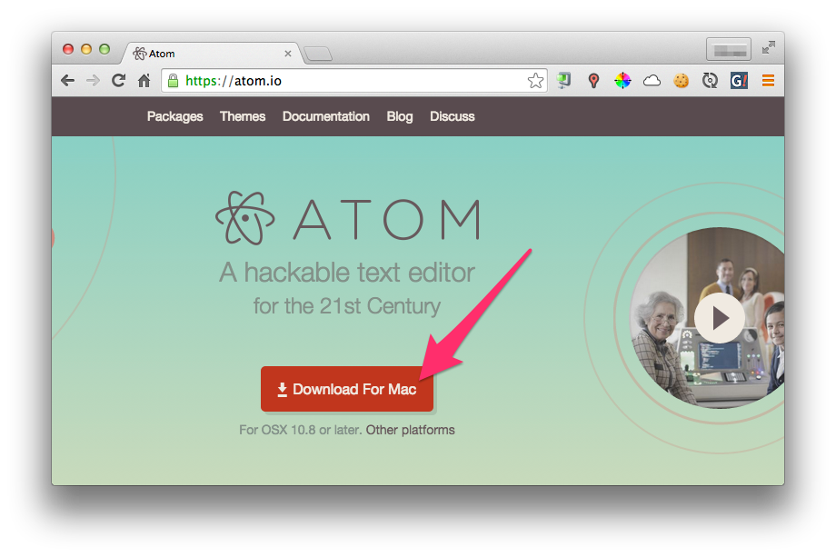
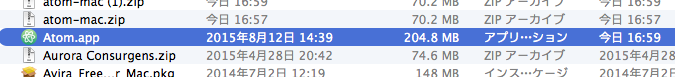
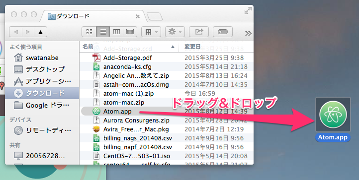
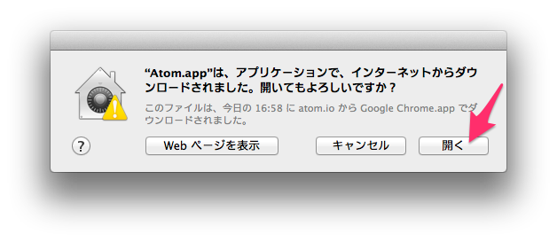
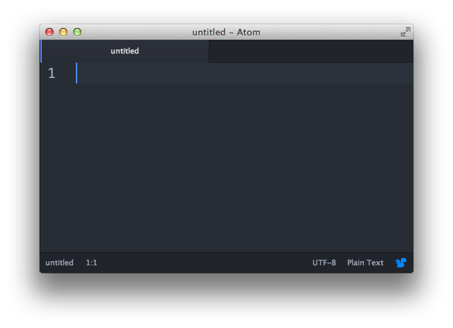

# 第1章 環境準備
## 概要
HTML5/CSS3の勉強をするための環境を整えます。

* エディタをインストールする
* 勉強会用のフォルダを作る

## テキストエディタインストール
HTMLとCSSはただのテキストファイルなのでメモ帳のようなテキストエディタで作成・編集することができます。まずはHTMLとCSSを編集するためのテキストエディタをインストールしましょう。既にお気に入りのテキストエディタがインストールされている方はそれで構いません。

Windowsの方はメモ帳でも十分です。Macは標準でいいテキストエディタがないので新しくインストールしてください。

Windows/Macどちらともおすすめは[Atom](https://atom.io/)です。ここではMacでのAtomのインストール方法を説明します。Windowsでもほぼ同じ方法でインストールできます。

まず https://atom.io/ にアクセスしてください。【Download For Mac】をクリックしてインストーラーをダウンロードしてください。

ダウンロードが完了したら、そのファイルを開いてください。開くとFinderが開いて「`Atom.app`」が表示されます(`.app`は表示されていないかもしれません)。

今後使いやすいように、このファイルをデスクトップにドラッグ&ドロップで移動してください。

次はデスクトップの「Atom.app」をクリックしてください。次のような画面が出た場合は【開く】をクリックしてください。

このような黒いテキストエディタが表示されればOKです！

## 勉強会用のフォルダを作る
次は勉強会用のフォルダを作ります。今回はコマンドを使って作成します。といっても簡単なコマンドしか使わないので安心してください。

まずはコマンドを入力するためのソフトを起動します。Windowsなら「コマンドプロンプト」、Macなら「ターミナル」といいます。今後、この資料ではどちらの場合も「ターミナル」と呼ぶことにします。

