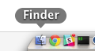
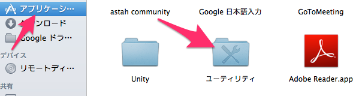
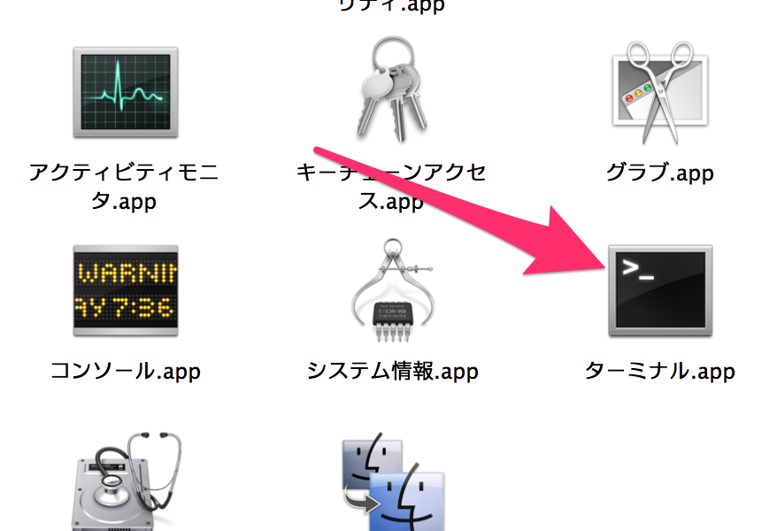
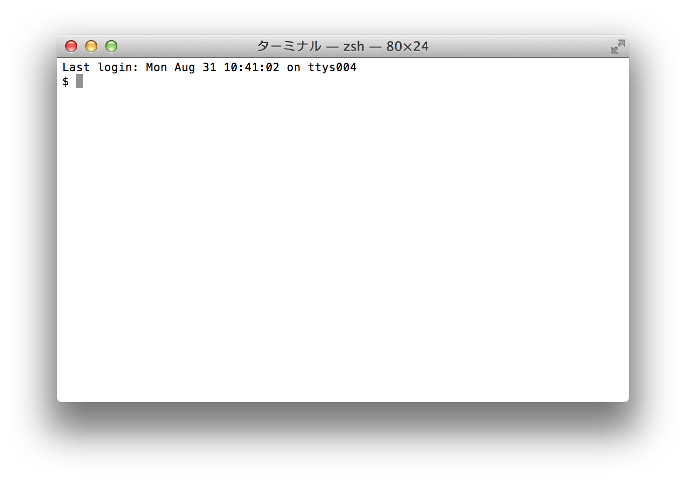
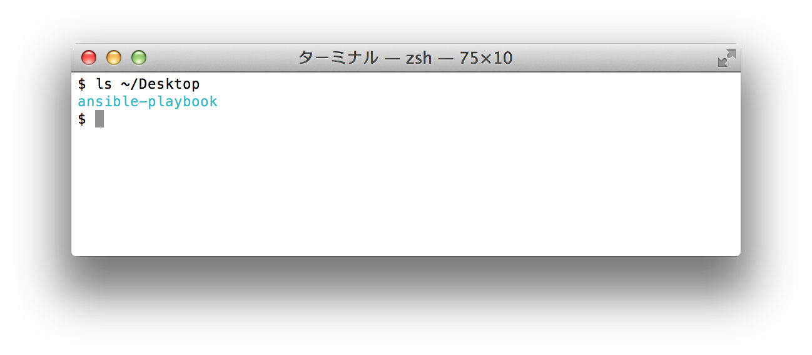
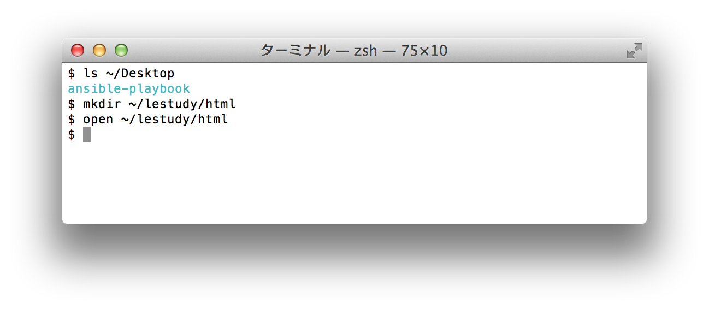
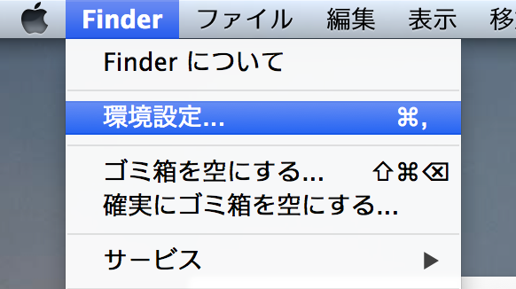
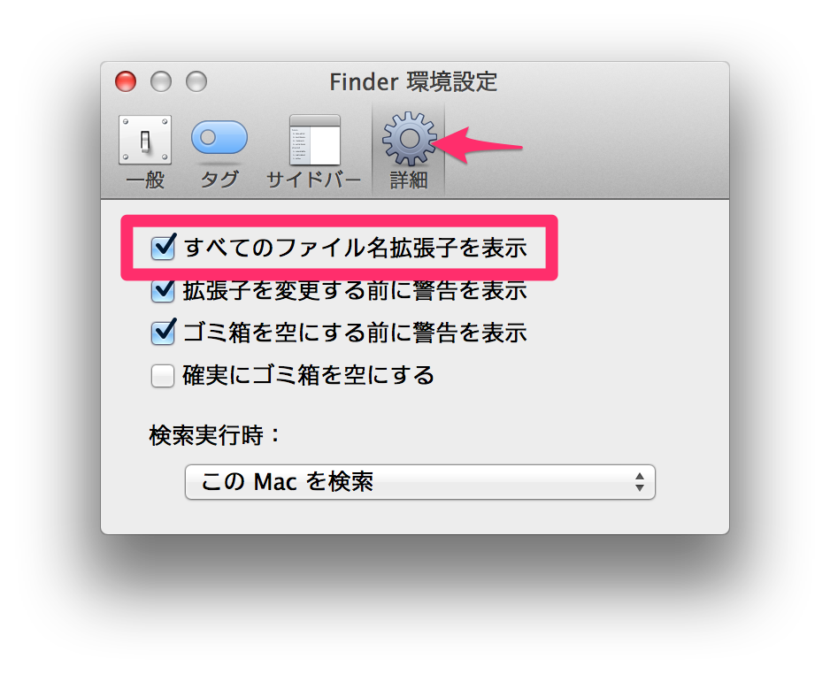

環境準備
=========

## 概要
HTML5/CSS3の勉強をするための環境を整えます。

* テキストエディタをインストールする
* 勉強会用のフォルダを作る
* 拡張子を表示する

## テキストエディタインストール
HTMLとCSSはただのテキストファイルなのでメモ帳のようなテキストエディタで作成・編集することができます。まずはHTMLとCSSを編集するためのテキストエディタをインストールしましょう。既にお気に入りのテキストエディタがインストールされている方はそれで構いません。

Windowsの方はメモ帳でも十分です。Macは標準でいいテキストエディタがないので新しくインストールしてください。

Windows/Macどちらともおすすめは[Atom](https://atom.io/)です。今後はAtomを基本に説明します。ここではMacでのAtomのインストール方法を説明します。Windowsでもほぼ同じ方法でインストールできます。

まず https://atom.io/ にアクセスしてください。【Download For Mac】をクリックしてインストーラーをダウンロードしてください。


ダウンロードが完了したら、そのファイルを開いてください。開くとFinderが開いて「`Atom.app`」が表示されます(`.app`は表示されていないかもしれません)。


今後使いやすいように、このファイルをデスクトップにドラッグ&ドロップで移動してください。


次はデスクトップの「Atom.app」をクリックしてください。次のような画面が出た場合は【開く】をクリックしてください。


このような黒いテキストエディタが表示されればOKです！


## 勉強会用フォルダ作成
次は勉強会用のフォルダを作ります。今回はコマンドを使って作成します。といっても簡単なコマンドしか使わないので安心してください。

まずはコマンドを入力するためのソフトを起動します。Windowsなら「コマンドプロンプト」、Macなら「ターミナル」といいます。今後、この資料ではどちらの場合も「ターミナル」と呼ぶことにします。

### Windowsでフォルダを作る
* Ctrl+Rでcmd
* mkdir %HOME%\lestudy\html

### Macでフォルダを作る
まずFinderを開いてください。FinderはDockにあると思います。



Finderが開いたら、左メニューの【アプリケーション】をクリックして、その中の「ユーティリティ」フォルダを開いてください。



その中の「ターミナル」をダブルクリックしてターミナルを開いてください。



次のような画面が表示されればOKです。
(`$`の部分に違いがあるかもしれませんが問題ありません)



この`$`の後ろのコマンドを入力して、最後にエンターキーを押すとコマンドによってPCを操作することができます。こうしてPCをを操作することを「コマンドを実行する」といいます。

例えばデスクトップに存在するファイル一覧を表示するには`ls ~/Desktop`というコマンドを入力してエンターキーを押します。



では次のコマンドでフォルダ(ディレクトリ)を作成してください。
このコマンドは`~/lestudy/html`というフォルダを作成するという意味のコマンドです。
`~`はホームディレクトリと呼ばれるフォルダです。その中に`lestudy`というフォルダを作り、さらにその中に`html`というフォルダを作成しています。

```bash
mkdir -p ~/lestudy/html
```

これで勉強会用のディレクトリが作成されました。Finderで開いてみましょう。Finderもコマンドから開くことができます。次のコマンドを実行してください。

```bash
open ~/lestudy/html
```



ターミナルは今後も使うことになるので開いておいてください。

## ファイル拡張子表示
今後ファイルを識別しやすくするために拡張子を表示するようにします。拡張子とはそのファイルの種類を表す接尾辞です。例えばテキストファイルなら`my_memo.txt`というように`.txt`という拡張子がついています。HTMLファイルなら`index.html`、CSSファイルなら`style.css`とそれぞれ`.html`と`.css`という拡張子がつきます。

WindowsもMacもデフォルトでは拡張子が表示されずファイルを見分けにくいので、表示するように設定します。

### Windowsで拡張子を表示する
### Macで拡張子を表示する
Finderの設定で拡張子を表示するようにします。
まずFinderを開いてください。
画面左上の【Finder】をクリックして「環境設定」を開いてください。



「詳細」タブをクリックして「すべてのファイル名拡張子を表示」にチェックをいれてください。



これでOKです。設定画面を閉じてください。