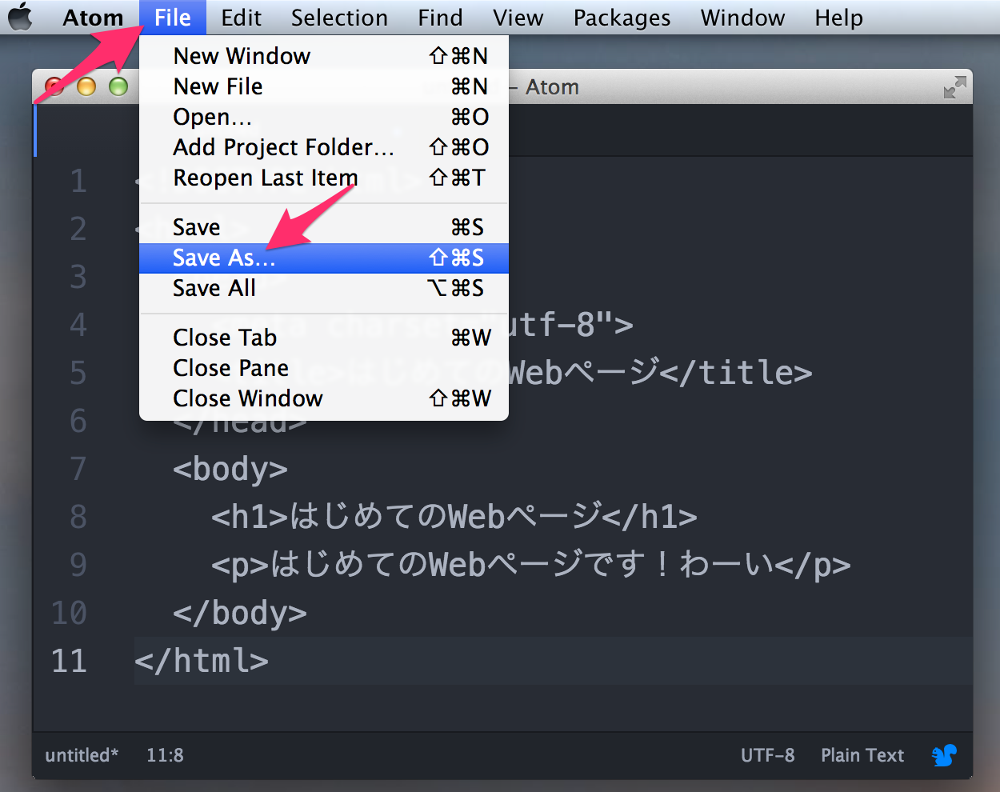
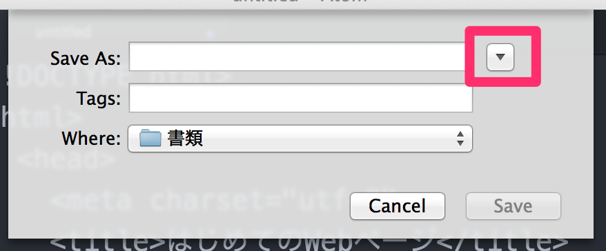
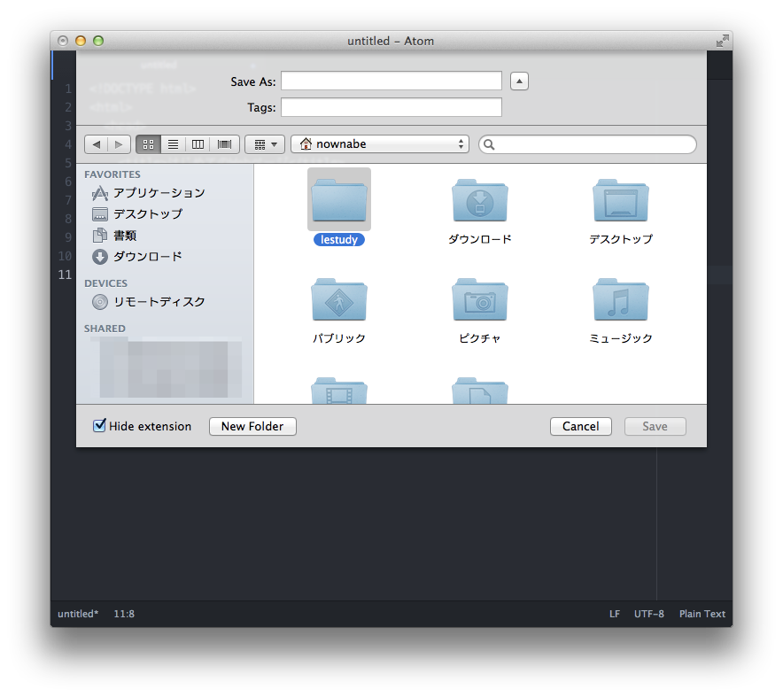
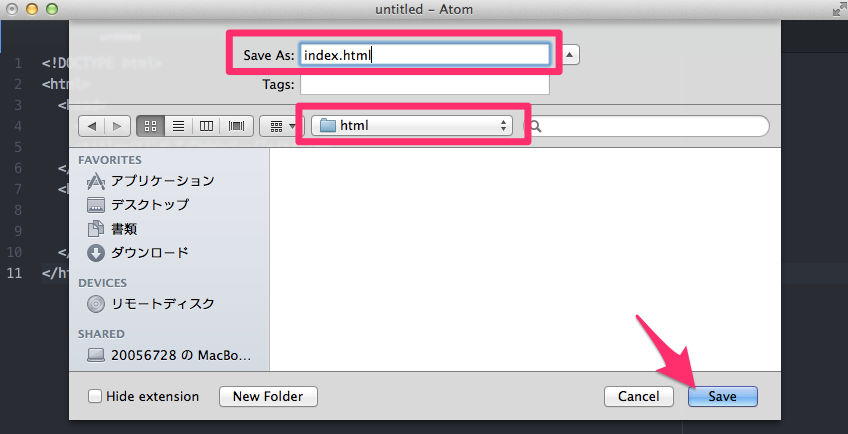
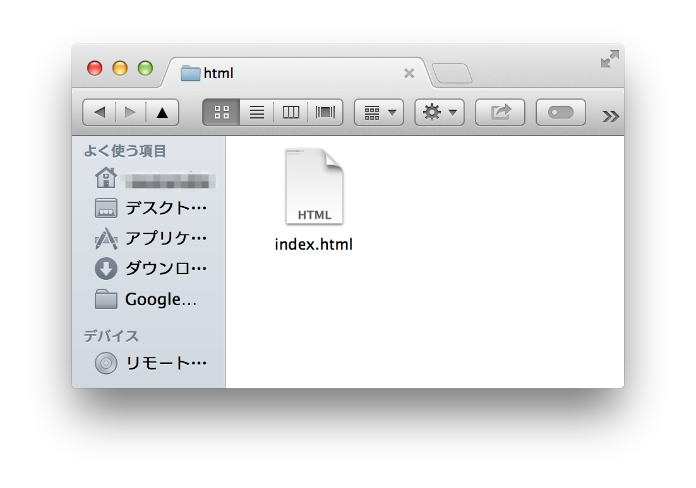
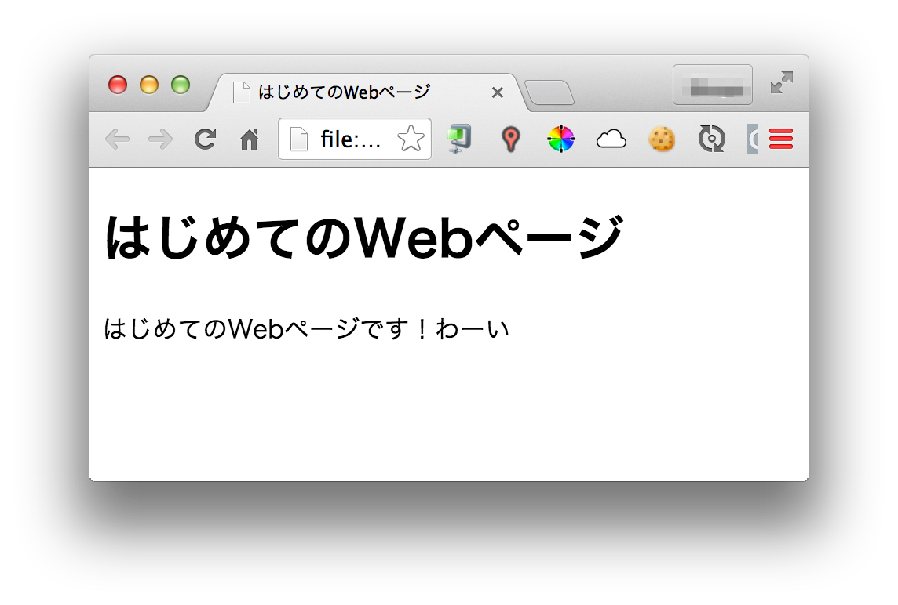

はじめてのWebページ
===================

## 概要
HTMLファイルを作成してブラウザで表示させてみます。

* `index.html`というHTMLファイルを作成する
* `profile.html`を作成する
* `index.html`から`profile.html`へリンクを作成する
* `profile.html`から`index.html`へリンクを作成する

## index.htmlを作る
まずは`index.html`を作成しましょう。
`index.html`はWebサイト(Webページの集合)のトップページとなるHTMLファイルです。

では早速テキストエディタを開いてください。
テキストエディタに次の内容を入力してください。

```html
<!DOCTYPE html>
<html>
  <head>
    <meta charset="utf-8">
    <title>はじめてのWebページ</title>
  </head>
  <body>
    <h1>はじめてのWebページ</h1>
    <p>はじめてのWebページです！わーい</p>
  </body>
</html>
```

これはWebページを構成するための必要最低限のHTMLです。
入力できたら、勉強会用のフォルダに`index.html`という名前で保存します。

Atomの場合はFileメニューの「Save as」をクリックしてください。



保存ダイアログが表示されるので、`~/lestudy/html`に`index.html`という名前で保存してください。

Windowsならライブラリのドキュメントに`lestudy`フォルダがあります。

Macの場合は下の図の通り▼ボタンをクリックしてください。



保存ダイアログが広がったら、キーボードで「Command + Shift + H」キーを押してください。同時押しです。
そうするとホームディレクトリが表示されるので`lestudy`フォルダが見つかります。



`lestudy/html`フォルダを選択したら「Save as」欄に`index.html`と入力して【Save】ボタンをクリックしてください。



これでHTMLファイルが保存できました。
ブラウザで表示してみましょう。

Finderで`lestudy/html`フォルダをみると、中に`index.html`ができています。



これをダブルクリックしてください。うまくいけば、次のようにWebページが表示されるはずです！



## profile.htmlを作る
次は`profile.html`を作成しましょう。
AtomのFileメニューから「New File」をクリックして、新しくファイルを作成します。

次のHTMLを適当に編集して`index.html`と同じように勉強会用フォルダ(`lestudy/html`)に`profile.html`として保存してください。

```html
<!DOCTYPE html>
<html>
  <head>
    <meta charset="utf-8">
    <title>自己紹介</title>
  </head>
  <body>
    <h1>自己紹介</h1>
    
    <section>
      <h2>なまえ</h2>
      <p>なまえはほげほげです。</p>
    </section>
    
    <section>
      <h2>しゅみ</h2>
      <p>しゅみはもげもげです。</p>
    </section>
    
    <section>
      <h2>とくぎ</h2>
      <p>とくぎはふがふがです。</p>
    </section>
  </body>
</html>
```

保存できたら`index.html`と同じように`profile.html`をダブルクリックして開いてみてください。

## リンクさせる
最後に`index.html`と`profile.html`を互いにリンクさせてみましょう。
まずは`index.html`から`profile.html`へのリンクを作成します。

先ほど作成した`index.html`を開いてください。