Webページを公開しよう
=====================

## 概要
作ったWebページをインターネットに公開します。
公開にはGithub Pagesというホスティングサービスを使います。

Gitについては詳しく説明しないので興味がある方は調べてみてください。

* Github Pagesとは
* Githubアカウント作成
* SourceTreeインストール
* Githubリポジトリ作成
* GithubにPushする

## Github Pagesとは
Github Pagesは無料でWebを公開できるWebホスティングサービスです。
WebホスティングサービスというかGithubの機能の一部なのですが、Webを公開するサーバーとして有力な選択肢になるほど素晴らしい機能になっています。

GithubはGit(バージョン管理システムのひとつ)のホスティングサービスであり、エンジニアのためのソーシャルコーディングサービスでもあります。
Githubを使えば快適にソフトウェアを開発できるようになっているため広く使われています。
ちなみにこの[テキスト](https://github.com/nownabe/webapp_tutorial)もGithubでバージョン管理されています。

今回はGithub Pagesを使ってWebページを公開します。

## Githubアカウント作成
まずはGithubのアカウントを作成してください。

[https://github.com/](https://github.com/)にアクセスしてください。

フォームに希望するユーザー名とメールアドレス、希望するパスワードを入力して【Sign up for GitHub】をクリックしてください。

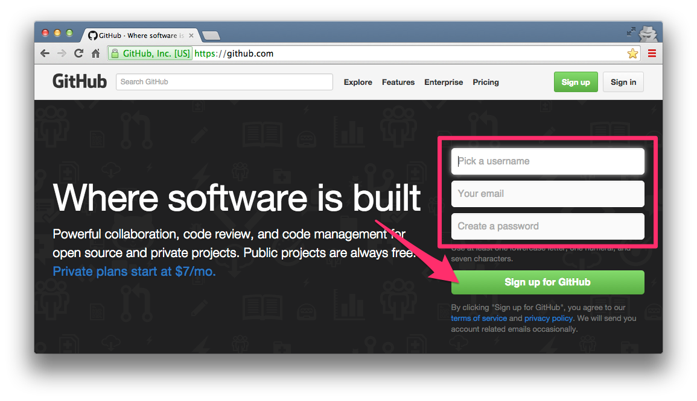

Freeプランが選択されていることを確認して【Finish sign up】をクリックしてください。

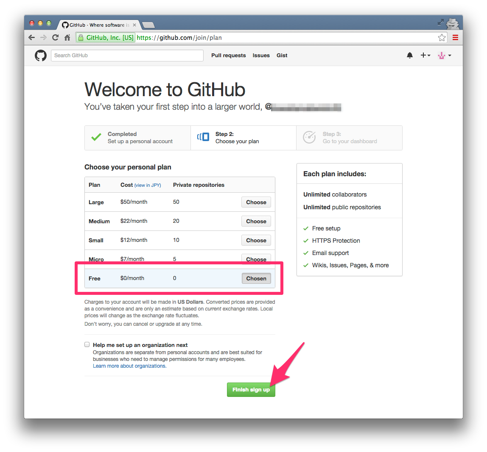

これで登録完了です。
確認メールが届くので【Verify email address】をクリックしてメールアドレスを認証してください。
メール認証していないとWebページは公開されません。

## SourceTreeインストール
GitのGUIツールであるSourceTreeをインストールします。

[https://www.sourcetreeapp.com/](https://www.sourcetreeapp.com/)にアクセスしてください。
【Download SourceTree Free】ボタンをクリックしてインストーラーをダウンロードしてください。
ダウンロードがはじまらない場合は、「direct link」をクリックしてください。

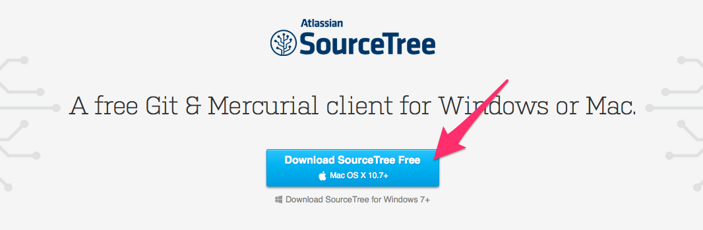

ダウンロードができたら、ダウンロードしたファイルを開いてください。
次のような画面が表示されるのでドラッグ&ドロップでインストールしてください。

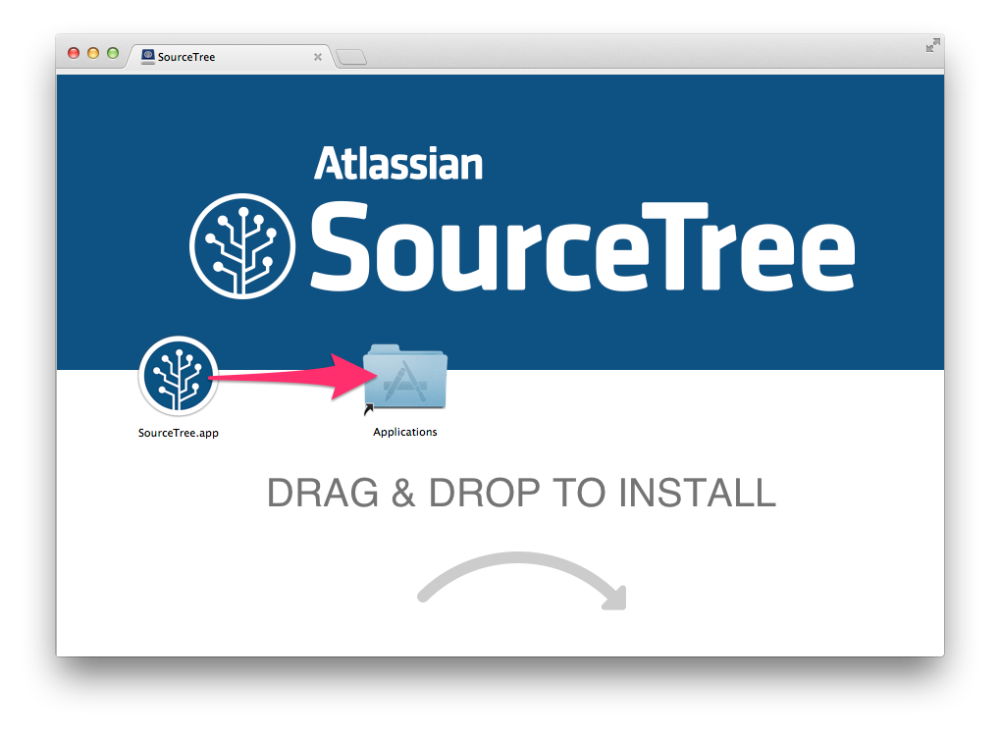

これでインストール完了です。
Finderを開き、アプリケーションフォルダでSourceTreeのアイコンをダブルクリックして起動してください。
次のような警告が出たら【開く】をクリックしてください。

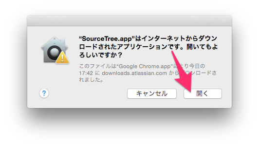

初期設定画面が表示されます。
「私は...同意する」にチェックをいれて【続ける】をクリックしてください。

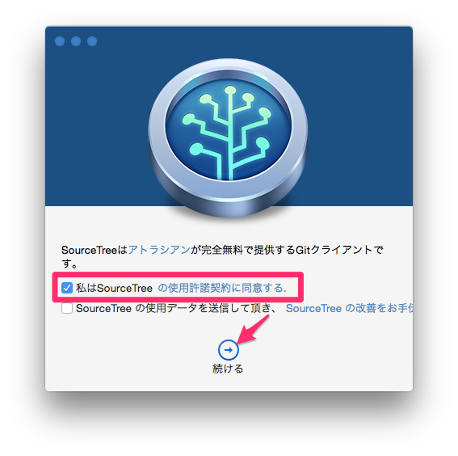

アカウント追加画面が表示されます。
Githubを選択しGithubのユーザ名とパスワードを入力して【続ける】をクリックしてください。

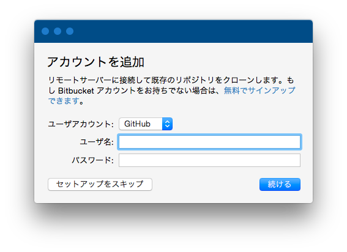

「はじめてリポジトリをクローンする」という画面がでたら【セットアップをスキップ】をクリックしてください。

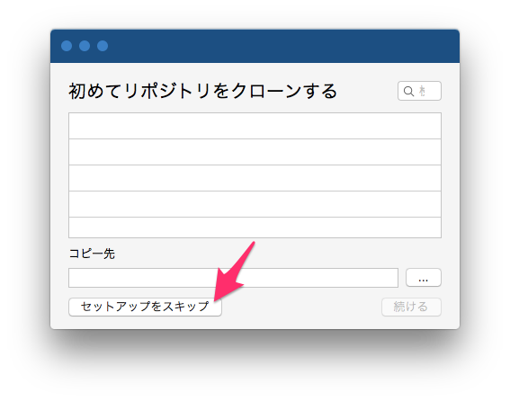

次のようなSourceTreeのメイン画面が表示されればOKです。

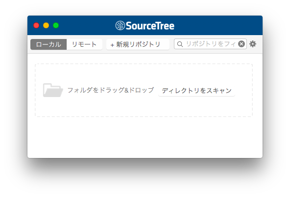

## Githubリポジトリ作成
Webページが存在する`lestudy/html`をGitのリポジトリとして登録します。
リポジトリとはGitでバージョン管理するアプリケーションの単位です。

SourceTreeの画面で【+新規リポジトリ】をクリックして、メニューの「ローカルリポジトリを作成」をクリックしてください。

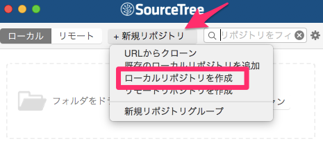

作成画面が表示されます。
次の通り入力して【作成】をクリックしてください。

* 保存先のパス: `lestudy/html`のフォルダ
* 名前: (自分のユーザ名).github.io
* タイプ: Git
* 「リモートリポジトリも作成」にチェック

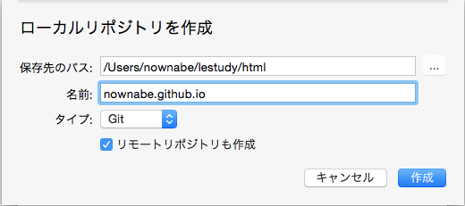

続いてリモートリポジトリ作成の画面が表示されます。
次のように入力して【Create】をクリックしてください。

* ユーザアカウント: GitHub - (自分のユーザ名)
* 所有者: (自分のユーザ名)
* 名前: (自分のユーザ名).github.io
* 説明: 空白のまま
* タイプ: Git
* 「This is a private repository」のチェックを外す

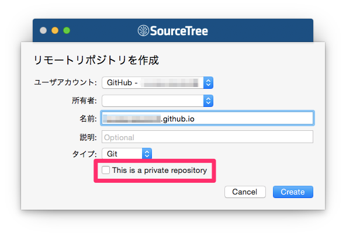

次のようにリポジトリが表示されればOKです。

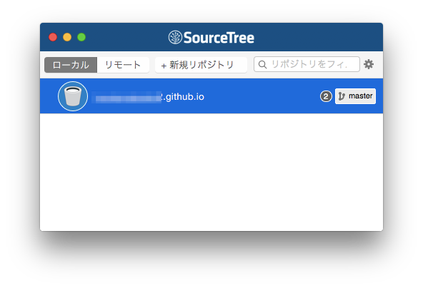

## GithubにPushする
それではGithubにWebページをPushしてWebページを公開しましょう。

SourceTreeで先ほど作ったリポジトリをダブルクリックしてください。
次のような画面が表示されます。
今後はこの画面を操作していきます。

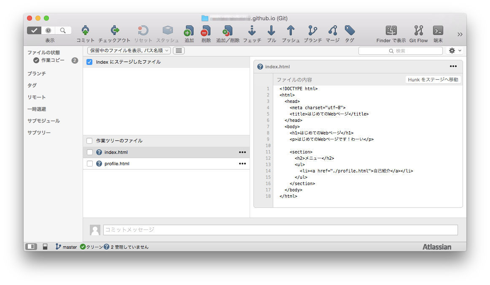

左下の「作業ツリーのファイル」というところに前回のコミットから変更されたファイルを意味しています。
(ここでは、コミット = GithubへのPush と考えてください)

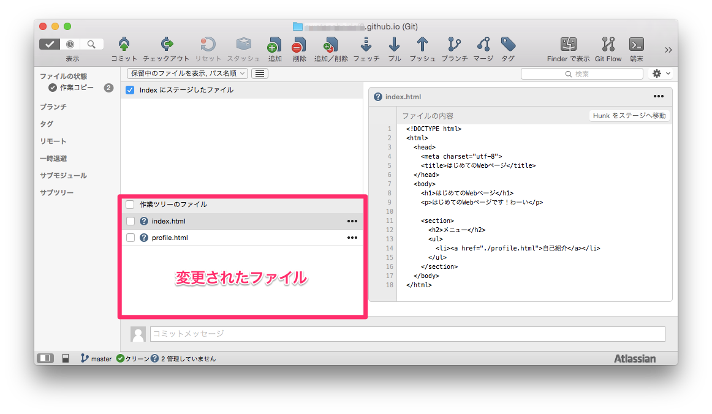

これらのファイルの左にあるチェックボックスにチェックをいれてください。
そうするとチェックしたファイルが左上の「Indexにステージしたファイル」に移動します。
ここは、これからコミット(Push)するファイルを意味しています。

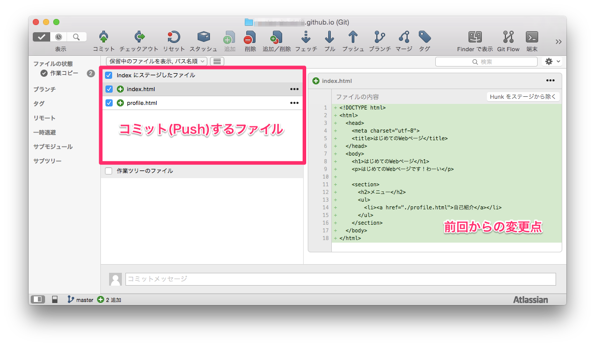

これでコミット(Push)する準備ができたので、左上の【コミット】ボタンをクリックしてください。

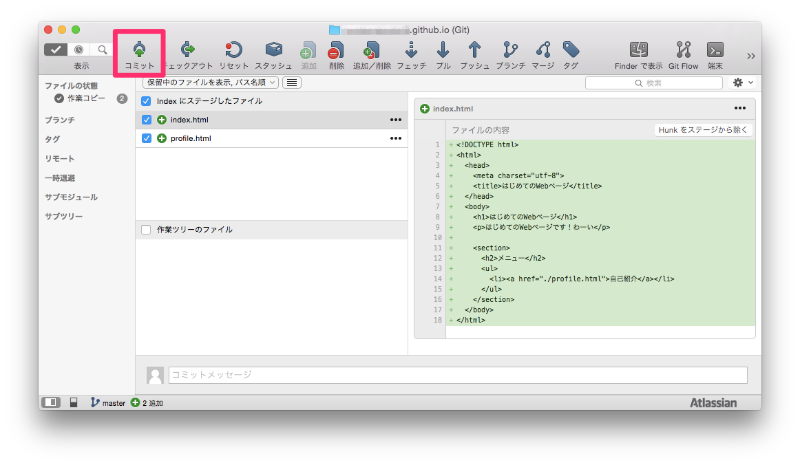

初回はユーザ情報の入力が求められるのでGithubのユーザー名とメールアドレスを入力して【OK】をクリックしてください。

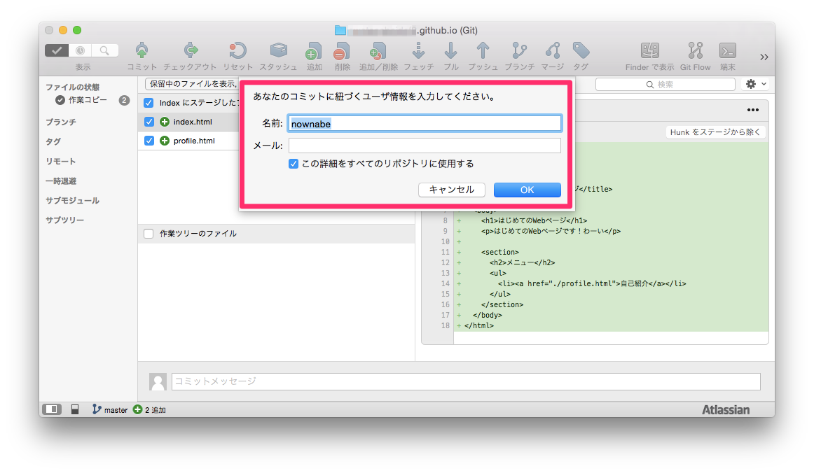

最後にコミットメッセージ(変更点の概要)を入力し、「コミットを直ちにプッシュする」にチェックをいれて、【コミット】ボタンをクリックしてください。

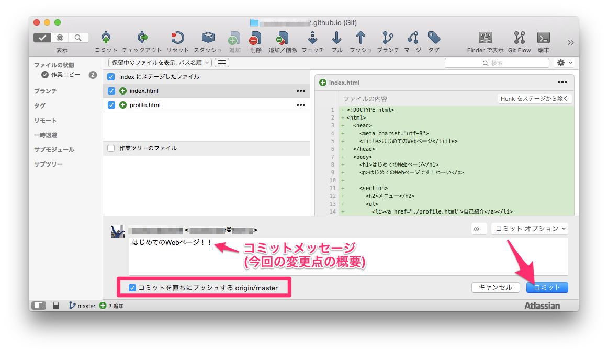

次のような画面が出たら【常に許可】をクリックしてください。

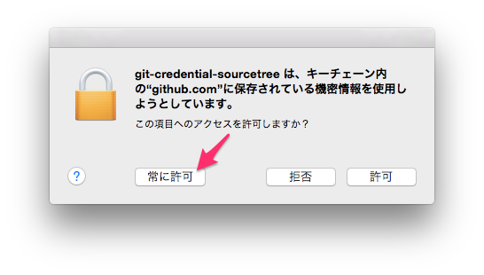

無事にPushが成功するとWebページが公開されているはずです。

ブラウザで`http://(自分のユーザ名).github.io/`にアクセスしてください。

反映されるまでに10分程かかる場合もあるので表示されない場合は待ってからリロードしてみてください。

Webページを修正して更新したい場合は、再度SourceTreeでコミット(Push)をしてください。
Github PagesのWebページに新しい内容が反映されます。