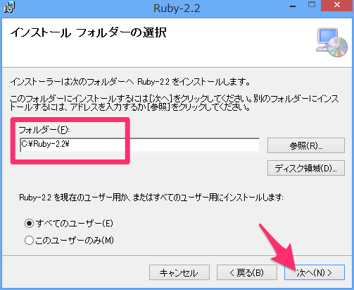
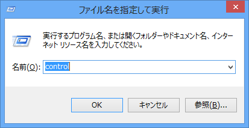
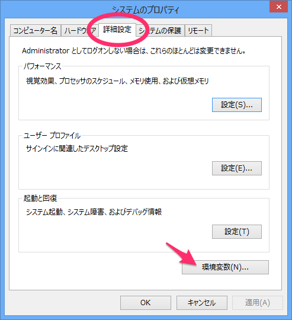
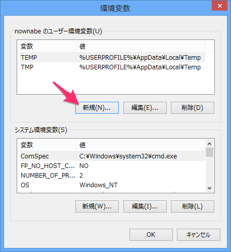
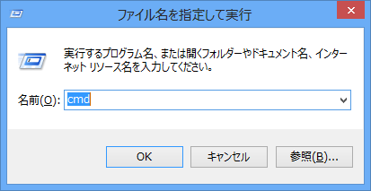
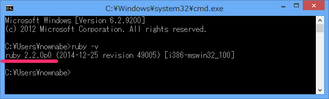
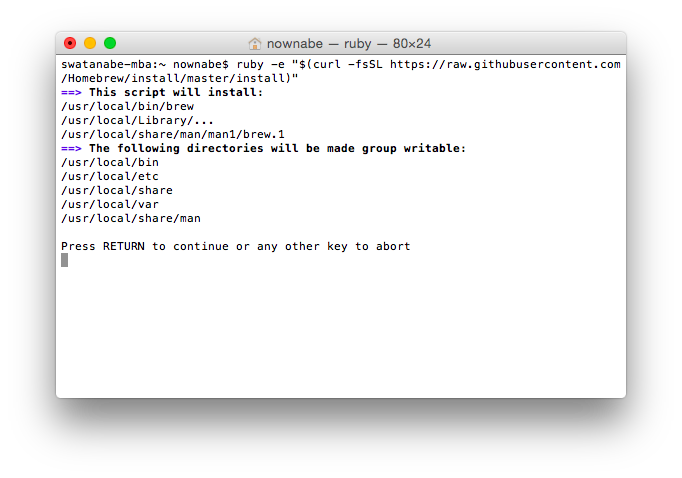

Slimで楽をしよう
=====================

## 概要
これまでHTMLやCSSを書いてきて、タグ書くのに毎回`<`と`>`をつけないといけないのがめんどくさいと思った方もいるんじゃないでしょうか？
そんな方は[プログラマーに向いています！](http://qiita.com/ggggnonaka/items/7ea0e6c545bea9ce22ee)

この章ではHTML/CSSをもっと楽に書く方法を軽く紹介します。

* Slimとは
* Rubyインストール
* Slimの使い方

## Slimとは
Slimとはテンプレートエンジンと呼ばれるもののひとつであり、テンプレート言語の一種です。
テンプレートエンジンとはプログラムでHTMLを生成するための仕組みです。
Webアプリケーションではよく利用されています。

その中でもSlimはHTMLの本質的な部分のみを記述すればいいようにできています。

例をみた方がはやいと思います。
次のHTMLを見てください。

```html
<!DOCTYPE html>
<html>
  <head>
    <meta charset="utf-8">
    <title>自己紹介</title>
  </head>
  <body>
    <h1>自己紹介</h1>

    <section>
      <h2>なまえ</h2>
      <p>なまえはほげほげです。</p>
    </section>

    <section>
      <h2>しゅみ</h2>
      <p>しゅみはもげもげです。</p>
    </section>

    <section>
      <h2>とくぎ</h2>
      <p>とくぎはふがふがです。</p>
    </section>
  </body>
</html>
```

これをSlimで書くと次のようになります。

```slim
doctype html
html
  head
    meta charset="utf-8"
    title 自己紹介
  body
    h1 自己紹介
    
    section
      h2 なまえ
      p なまえはほげほげです。
    
    section
      h2 しゅみ
      p しゅみはもげもげです。
    
    section
      h2 とくぎ
      p とくぎはふがふがです。
```

このSlimを変換すると、上のHTMLとまったく同じものが生成されます。

いかがでしょうか。だいぶすっきりしました。
`<`と`>`がなくなっていたり、閉じタグを使わずインデントで木構造を表現してたりします。

HTMLの無駄な部分を極限まで削った感じになっています。

## Rubyインストール
SlimはRubyというプログラミング言語で書かれています。
そのためSlimからHTMLに変換するためにはRubyをインストールする必要があります。

MacとWindowsで手順が異なります。

### WindowsでRubyインストール
Windowsではインストーラーを使ってRubyをインストールします。
次のURLからインストーラーをダウンロードしてください。

[http://www.artonx.org/data/asr/Ruby-2.2.msi](http://www.artonx.org/data/asr/Ruby-2.2.msi)

ダウンロードできたらインストーラーを起動してインストールしてください。
インストールの途中の「インストールフォルダー」ではフォルダーを「`C:\Ruby-2.2\`」と入力してください。



インストールが完了したらPATHの設定を行います。
コマンドプロンプトからRubyを使うために必要です。

【Widndowsキー + R】で「ファイル名を指定して実行」ダイアログを出して「`control`」と入力して【OK】ボタンをクリックしてください。



「システムとセキュリティ」をクリックしてください。


「システム」をクリックしてください。


「設定の変更」をクリックしてください。


「システムのプロパティ」という画面が表示されるので、「詳細設定」タブの【環境変数(N)...】ボタンをクリックしてください。



また新しい画面が表示されます。【新規(N)...】をクリックしてください。すでに`PATH`という変数がある場合は`PATH`を選択して【編集】ボタンをクリックしてください。



変数名に「`PATH`」、変数値に「`C:\Ruby-2.2\bin`」と入力してください。
既に`PATH`があった場合は変数値の末尾に`;`(セミコロン)で区切って追加してください。


【OK】ボタンを連打して設定画面を閉じてください。
次に、【Windowsキー + R】で「`cmd`」と入力してコマンドプロンプトを起動してください。



次のコマンドを実行して、Rubyのバージョンが表示されれば成功です！



### MacでRubyインストール
Macでインストールする手順は少し複雑です。次の流れでインストールしていきます。

* Homebrewインストール
* 必要パッケージインストール
* anyenvインストール
* rbenvインストール
* Ruby 2.2インストール

まずはHomebrewをインストールします。
ターミナルを開いて次のコマンドを実行してください。
途中でEnterキーやパスワードを入力する必要があります。

```bash
ruby -e "$(curl -fsSL https://raw.githubusercontent.com/Homebrew/install/master/install)"
```



次のコマンドでバージョンが表示されれば成功です。

```bash
brew -v
```

次にHomebrewを使ってRubyのインストールに必要なソフトをインストールします。
次のコマンドを実行してください。

```bash
brew install openssl libyaml libffi readline
```

次にanyenvをインストールします。
次の一連のコマンドを順に実行してください。(1行1コマンド)

```bash
git clone https://github.com/riywo/anyenv ~/.anyenv
echo 'export PATH="$HOME/.anyenv/bin:$PATH"' >> ~/.bash_profile
echo 'eval "$(anyenv init -)"' >> ~/.bash_profile
mkdir ~/.anyenv/plugins
git clone https://github.com/znz/anyenv-update.git ~/.anyenv/plugins/anyenv-update
exec $SHELL -l
```

次にrbenvをインストールします。
次のふたつのコマンドを実行してください。

```bash
anyenv install rbenv
exec $SHELL -l
```

最後にRubyをインストールします。
次のコマンドを実行してください。

```bash
rbenv install 2.2.3
rbenv global 2.2.3
```

次のコマンドでRubyのバージョンが表示されれば成功です！

```bash
ruby -v
```


## Slimの使い方
### Slimインストール
WindowsもMacも次のコマンドでSlimをインストールできます。

```bash
gem install slim
```

### 基本的な書き方
詳しい書き方は他の記事を参照してください。

* [速習テンプレートSlim(HTML作成編)](http://qiita.com/yterajima/items/53fd0387279510ff082a)
* [Slim](http://slim-lang.com/)

Slimの拡張子は`.slim`になります。例えば`index.html`を生成するためのSlimコードは`index.html.slim`のようなファイル名にするとGoodです。

Slimでもドキュメントタイプの指定は必要になります。
HTML5を表すにはSlimファイルの先頭で次のように書きます。

```slim
doctype html
```

HTMLよりさらにシンプルですね。

SlimではHTMLタグをかぎかっこ(`<>`)なしで表現します。
また、木構造をインデントで表すため終了タグは不要です。
半角スペース2個でひとつのインデントになります。

次のように、要素名をインデントでずらしていってHTMLの木構造を表現していきます。

```slim
doctype html
html
  head
    meta charset="utf-8"
    title ほげほげ
  body
    h1 ほげほげほげ
```

属性はHTMLタグと同じように要素名の後ろに`属性名="属性値"`という形で書きます。

要素の内容は要素名の後ろにスペースで区切って記述します。
内容が長い場合は、次のようにパイプ(`|`)を使って書くことができます。

```slim
p
  | ほげほげほげ
  | もげもげもげ
  | ふがふがふが
```

これをHTMLに変換すると次のようになります。

```html
<p>ほげほげほげほげもげもげもげもげふがふがふがふが</p>
```

class属性とid属性には特別な記法が用意されいてます。
要素名の後ろに`.クラス名`と書くことでクラスを指定できます。
`#id名`と書くことでidを指定できます。

```slim
section#shumi
  p.sono1 foo
  p.sono2 bar
```

これを変換すると次のようなHTMLになります。

```html
<section id="shumi">
  <p class="sono1">foo</p>
  <p class="sono2">bar</p>
</section>
```

### HTMLに変換する
SlimをHTMLに変換するには`slimrb`というコマンドを使います。

例えば`index.html.slim`を`index.html`に変換するには次のコマンドを実行してください。

```bash
slimrb index.html.slim index.html
```

このコマンドを実行するには`index.html.slim`があるフォルダに移って実行する必要があります。

Windowsなら

```
cd %USERPROFILE%\Documents\lestudy\html
```

Macなら

```bash
cd ~/lestudy/html
```

で移動できます。