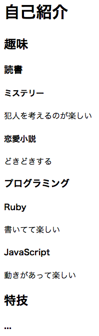

さまざまなHTMLタグ
===================

## 概要
HTMLの基本的なタグを紹介します。
body要素の中で使用する(ブラウザで表示される)タグに限って紹介します。

全てのタグは紹介しませんので必要に応じて[リファレンスサイト](http://www.htmq.com/html5/index.shtml)などを参照してください。

## h1, h2, h3, h4, h5, h6要素
文書の章や節のタイトル・見出しを定義する要素です。

数字が小さいほど階層が上であることを示します。
次のようなイメージです。

```html
<h1>自己紹介</h1>
  <h2>趣味</h2>
    <h3>読書</h3>
      <h4>ミステリー</h4>
        <p>犯人を考えるのが楽しい</p>
        
      <h4>恋愛小説</h4>
        <p>どきどきする</p>
    <h3>プログラミング</h3>
      <h4>Ruby</h4>
        <p>書いてて楽しい</p>
      
      <h4>JavaScript</h4>
        <p>動きがあって楽しい</p>

  <h2>特技</h2>
    <h3>...</h3>
```



## p要素
段落(paragraph)を表す要素です。

```html
<p>吾輩は猫である。名前はまだ無い。<p>
<p>
  どこで生れたかとんと見当がつかぬ。
  何でも薄暗いじめじめした所でニャーニャー泣いていた事だけは記憶している。
  吾輩はここで始めて人間というものを見た。
  ...
</p>
```

## section要素
文書の塊、セクションを定義します。

```html
<h1>自己紹介</h1>

<section>
  <h2>趣味</h2>
    
  <section>
    <h3>読書</h3>
    
    <section>
      <h4>ミステリー</h4>
      <p>犯人を考えるのが楽しい</p>
    </section>
      
    <section>
      <h4>恋愛小説</h4>
      <p>どきどきする</p>
    </section>
  </section>
  
  <section>
    <h3>プログラミング</h3>
    
    <section>
      <h4>Ruby</h4>
      <p>書いてて楽しい</p>
    </section>
    
    <section>
      <h4>JavaScript</h4>
      <p>動きがあって楽しい</p>
    </section>
  </section>
</section>
  
<section>
  <h2>特技</h2>
  ...
</section>
```

## header要素
文書全体やセクションのヘッダを表します。
タイトルや目次などをいれます。

```html
<body>
  <header>
    <h1>自己紹介</h1>
  </header>
  <section>
    <header>
      <h2>趣味</h2>
      ...
    </header>
  </section>
</body>
```

## footer要素
文書全体やセクションのフッタを表します。
著者の連絡先や関連ページへのリンクをいれます。

```html
<body>
  ...
  
  <footer>
    <p>Copyright (c) nownabe<p>
    <p>連絡先: @nownabe xxx-yyyy-zzzz</p>
  </footer>
</body>
```

## a要素

## ul, ol, li要素

## b, i, em, strong要素

## img要素

## table要素