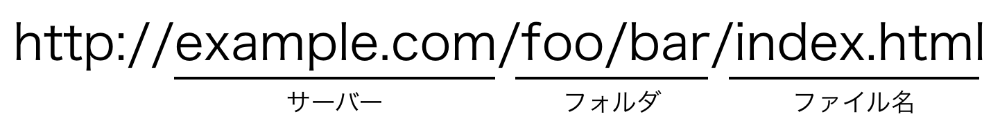
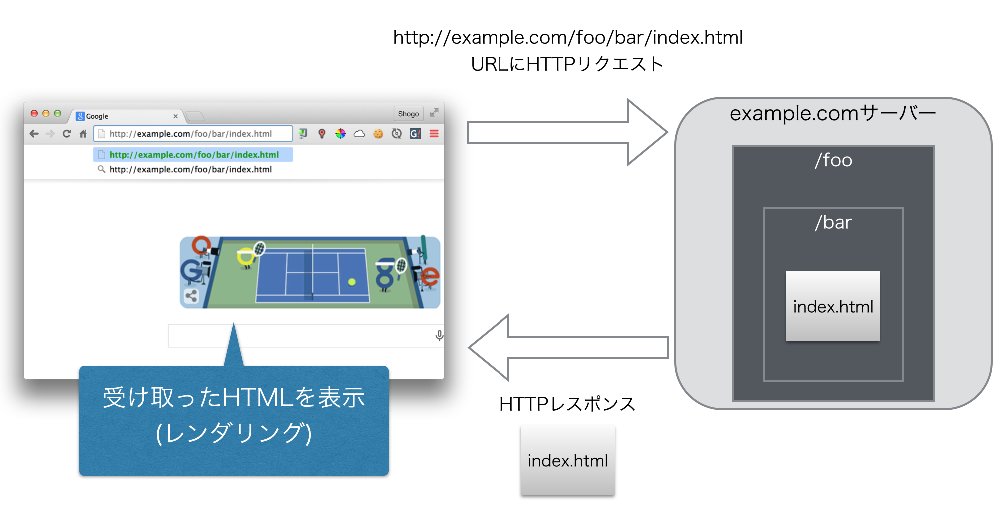

Webの復習
=========

## 概要
Webページに必要な知識をおさらいします。

* Webページとはなにか
* URLとはなにか
* Webページがブラウザで表示されるまで
* Webページを構成する要素

## Webページ
Webページとはインターネットで公開されている文書のことです。
Webページはお互いにハイパーリンク(Hyperlink)によって結び付けられています。
このような文書をハイパーテキスト(Hypertext)といいます。

ハイパーリンクは他の文書のURLを参照することで実現しています。
インターネット上でハイパーリンクが蜘蛛の巣のように広がっていることから、ハイパーテキストシステムはWorld Wide Web (Webは蜘蛛の巣という意味)と名付けられました。

## URL
URL(Uniform Resource Locator)はWebページの住所のようなものです。
それぞれのWebページはユニークなURLを持っています。
ユーザーはブラウザにURLを打ち込むことでそのWebページを閲覧することができます。

URLは`https://ja.wikipedia.org/wiki/Uniform_Resource_Locator`のような`/`(スラッシュ)で区切られた文字列で表されます。

次のURLを見てください。



このURLは簡単に言うと、

* `example.com`というサーバーの
* `/foo/bar`というフォルダの
* `index.html`というファイル

の場所を指し示しています。
`http://`はHTTP (HyperText Transfer Protocol)でアクセスする物だということを表しています。

ハイパーテキストではこのようなURLを参照することで、お互いにハイパーリンクを結び合っています。

## ブラウザ
ブラウザはWebページを閲覧するためのソフトウェアです。
代表的なものにInternet Explorer、Google Chrome、Firefoxなどがあります。

ブラウザがどのようにしてWebページを表示しているかを簡単に表したのが下の図になります。



ブラウザはWebページを新しく表示するとき(例えばURLが入力されたり、お気に入りのサイトがクリックされたり、Webページ内のリンクがクリックされたり)、URLのサーバーにHTTPのリクエストを送信します。
この図の場合だと`example.com`というサーバーに「`/foo/bar/index.html`というファイルをくれ」とリクエストを送信します。
するとサーバーから`/foo/bar/index.html`の内容がレスポンスとして送られてきます。
ブラウザはその内容を受け取ったら、その内容に従ってWebページを画面に表示します。
このことをレンダリングと言います。

## HTML / CSS / JavaScript
Webページは主に次の要素によって構成されます。

### HTML
HTML(HyperText Markup Language)はハイパーテキストの内容と構造を記述するためのマークアップ言語です。
Webページを作る上での主役です。

マークアップ言語とは文書の内容に機械的に意味を与えるための人工言語です。
例えばWebページにタイトルをつけるときは

```html
<title>Webアプリを作ろう！</title>
```

のように機械(ブラウザ)が理解しやすいようにマークアップします。

### CSS
CSS(Cascading Style Sheets)はWebページの見た目を記述するためのものです。
CSSを使うことで文字のサイズや色、各要素の幅や余白を設定することができます。

例えばWebページの背景を黒くして文字を白くするには次のように記述します。

```css
body {
  background-color: black;
  color: white;
}
```

### JavaScript
JavaScriptはブラウザで実行されるプログラミング言語です。Webページに動きをつけたり、裏でサーバーと通信したりするために使われます。

### その他
画像ファイルや動画ファイルもWebページを構成する要素のひとつです。