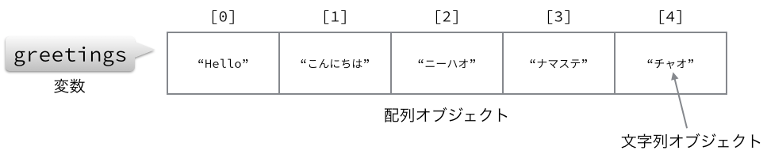

# 配列
## 概要
複数のオブジェクトを束ねるための__配列__というデータ構造について説明します。

## 配列とは
__配列__(__Array__)は複数のオブジェクトを並べてまとめるためのオブジェクトです。
配列に格納されているオブジェクトを__要素__といい、それぞれに__インデックス__と呼ばれる番号が順番についています。

つぎのコードでは図のような配列が作られます。

```ruby
greetings = ["Hello", "こんにちは", "ニーハオ", "ナマステ", "チャオ"]
```



ひとつの配列オブジェクトの中に、`"Hello"`や`"こんにちは"`などの文字列オブジェクトが5つ格納されています。
それぞれの要素(オブジェクト)には0から順番にインデックスがついています。

要素は`[インデックス]`をつけることで参照することができます。

```irb
>> greetings = ["Hello", "こんにちは", "ニーハオ", "ナマステ", "チャオ"]
=> ["Hello", "こんにちは", "ニーハオ", "ナマステ", "チャオ"]

# 0番目を取り出す
>> greetings[0]
=> "Hello"

# 3番めを取り出す
>> greetings[3]
=> "ナマステ"
```

## 配列の作成
配列を作成する方法は何種類かあります。
一番良く使うのは、全体を`[ ]`で囲んで要素を`,`(カンマ)で区切る方法です。
要素数は0から何個でも大丈夫です。

```ruby
# 要素が0個の配列
arr1 = []

# 要素が3個の配列
arr2 = ["要素0", "要素1", "要素2"]

# 要素数は何個でもOK
arr3 = ["要素0", "要素1", ..., "要素n"]
```

要素は文字列オブジェクトだけでなく、どんなオブジェクトでも格納することができます。

```ruby
arr = ["文字列だけでなく", 1999, "整数も", 0.08, "小数も", Time.now, "どんなオブジェクトもOK"]
```

直接リテラルを書かず変数を使うこともできます。

```ruby
english  = "Hello"
japanese = "こんにちは"
chinese  = "ニーハオ"

greetings = [english, japanese, chinese]
```

要素と要素の間に改行をいれて読みやすくすることもできます。

```ruby
shoguns = [
  "家康",
  "秀忠",
  "家光",
  "家綱",
  
  # ...省略...
  
  "家茂",
  "慶喜"
]
```

`[ ]`を使う方法以外では、`Array.new`を使う方法や他のオブジェクトから`to_a`で変換する方法などがあります。

`Array.new`では引数に配列の長さや要素の初期値を与えます。

```irb
# Array.newを使うと決まった長さの配列を作れる
# デフォルトの初期値はnil
>> Array.new(5)
=> [nil, nil, nil, nil, nil]

# 第2引数に初期値を与えることもできる
>> Array.new(3, "初期値")
=> ["初期値", "初期値", "初期値"]
```

`to_a`は、例えば範囲オブジェクトなどから変換することができます。

```irb
>> (1..10).to_a
=> [1, 2, 3, 4, 5, 6, 7, 8, 9, 10]
```

文字列を配列にしたい場合は、`chars`メソッドや`lines`メソッドを使います。

```irb
# 1文字ずつ配列にする
>> "Hello, world!".chars
=> ["H", "e", "l", "l", "o", ",", " ", "w", "o", "r", "l", "d", "!"]

# 1行ずつ配列にする
>> text = <<EOS
複数行の
文字列の場合は
linesメソッドを使えば
配列になる
EOS
=> "複数行の\n文字列の場合は\nlinesメソッドを使えば\n配列になる\n"

>> text.lines
=> ["複数行の\n", "文字列の場合は\n", "linesメソッドを使えば\n", "配列になる\n"]
```

## 配列の基本操作
配列の基本的な操作について説明します。

* 参照
* 置換
* 要素追加
* 要素削除
* 結合
* 長さ

### 要素の参照
要素を参照するには`[インデックス]`を配列につけます。
存在しない要素のインデックスを指定した場合は`nil`となります。

```irb
>> greetings = ["Hello", "こんにちは", "ニーハオ", "ナマステ", "チャオ"]
=> ["Hello", "こんにちは", "ニーハオ", "ナマステ", "チャオ"]
>> greetings[0]
=> "Hello"
>> greetings[1]
=> "こんにちは"
>> greetings[4]
=> "チャオ"

# 要素存在しないインデックスはnil
>> greetings[5]
=> nil
```

また、マイナスの値を指定すると、後ろから数えた要素になります。

```irb
>> greetings[-1]
=> "チャオ"
>> greetings[-5]
=> "Hello"
>> greetings[-6]
=> nil
```

範囲オブジェクトにすると部分配列を取り出せます。

```irb
# 指定した範囲の部分配列となる
>> greetings[1..3]
=> ["こんにちは", "ニーハオ", "ナマステ"]

# 存在しない部分は無視される
>> greetings[1..100]
=> ["こんにちは", "ニーハオ", "ナマステ", "チャオ"]

# マイナスでも範囲指定できる
>> greetings[3..-1]
=> ["ナマステ", "チャオ"]
```

### 要素の置換
次のようにすると既にある要素を置き換えることもできます。

```ruby
配列[インデックス] = 置換後のオブジェクト
```

次のコードでは5番目の`"チャオ"`を`"ジャンボ"`に置き換えています。

```irb
>> greetings
=> ["Hello", "こんにちは", "ニーハオ", "ナマステ", "チャオ"]
>> greetings[4] = "ジャンボ"
=> "ジャンボ"
>> greetings
=> ["Hello", "こんにちは", "ニーハオ", "ナマステ", "ジャンボ"]
```

配列サイズよりも大きいインデックスを指定すると、配列が拡大されて要素が格納されます。

```irb
>> greetings
=> ["Hello", "こんにちは", "ニーハオ", "ナマステ", "ジャンボ"]
>> greetings[10] = "チャオ"
=> "チャオ"
>> greetings
=> ["Hello", "こんにちは", "ニーハオ", "ナマステ", "ジャンボ", nil, nil, nil, nil, nil, "チャオ"]
```

### 要素の追加
`[]=`で要素を追加することもできますが、もっと便利なメソッドが用意されています。

配列の先頭に要素を追加するには`unshift`メソッドを使います。

```irb
>> greetings = ["Hello", "こんにちは", "ニーハオ", "ナマステ", "チャオ"]
=> ["Hello", "こんにちは", "ニーハオ", "ナマステ", "チャオ"]
>> greetings.unshift("アホイ")
=> ["アホイ", "Hello", "こんにちは", "ニーハオ", "ナマステ", "チャオ"]
>> greetings
=> ["アホイ", "Hello", "こんにちは", "ニーハオ", "ナマステ", "チャオ"]
```

配列の末尾に要素を追加するには`push`メソッドを使います。

```irb
>> greetings = ["Hello", "こんにちは", "ニーハオ", "ナマステ", "チャオ"]
=> ["Hello", "こんにちは", "ニーハオ", "ナマステ", "チャオ"]
>> greetings.push("アホイ")
=> ["Hello", "こんにちは", "ニーハオ", "ナマステ", "チャオ", "アホイ"]
>> greetings
=> ["Hello", "こんにちは", "ニーハオ", "ナマステ", "チャオ", "アホイ"]
```

### 要素の削除
要素を削除するのにもいくつか方法があります。

指定された位置の要素を削除するには`delete_at`を使います。

```irb
>> greetings = ["Hello", "こんにちは", "ニーハオ", "ナマステ", "チャオ"]
=> ["Hello", "こんにちは", "ニーハオ", "ナマステ", "チャオ"]
>> greetings.delete_at(3)
=> "ナマステ"
>> greetings
=> ["Hello", "こんにちは", "ニーハオ", "チャオ"]
```

先頭の要素を削除するには`shfit`を使います。

```irb
>> greetings = ["Hello", "こんにちは", "ニーハオ", "ナマステ", "チャオ"]
=> ["Hello", "こんにちは", "ニーハオ", "ナマステ", "チャオ"]
>> greetings.shift
=> "Hello"
>> greetings
=> ["こんにちは", "ニーハオ", "ナマステ", "チャオ"]
```

末尾の要素を削除するには`pop`を使います。

```irb
>> greetings = ["Hello", "こんにちは", "ニーハオ", "ナマステ", "チャオ"]
=> ["Hello", "こんにちは", "ニーハオ", "ナマステ", "チャオ"]
>> greetings.pop
=> "チャオ"
>> greetings
=> ["Hello", "こんにちは", "ニーハオ", "ナマステ"]
```

指定したオブジェクトと一致する要素を削除するには`delete`を使います。

```irb
>> greetings = ["Hello", "こんにちは", "ニーハオ", "ナマステ", "チャオ"]
=> ["Hello", "こんにちは", "ニーハオ", "ナマステ", "チャオ"]
>> greetings.delete("ニーハオ")
=> "ニーハオ"
>> greetings
=> ["Hello", "こんにちは", "ナマステ", "チャオ"]
```

### 配列の結合
`+`を使えば2つの配列を結合することができます。

```irb
>> asia = ["こんにちは", "ニーハオ"]
=> ["こんにちは", "ニーハオ"]
>> other = ["Hello", "チャオ"]
=> ["Hello", "チャオ"]

# +で結合する
>> greetings = asia + other
=> ["こんにちは", "ニーハオ", "Hello", "チャオ"]
```

### 配列の長さ
配列の長さは`length`メソッドか`size`メソッドで取得できます。

```irb
>> greetings = ["Hello", "こんにちは", "ニーハオ", "ナマステ", "チャオ"]
=> ["Hello", "こんにちは", "ニーハオ", "ナマステ", "チャオ"]
>> greetings.size
=> 5
>> greetings.length
=> 5
```

## 配列の繰り返し処理
配列は要素を順番に繰り返し処理できることができます。

### each
もっとも単純な繰り返し処理を行うメソッドは`each`です。
配列のそれぞれの要素に対してブロックの処理を繰り返します。
ブロック変数に要素が入ります。

```irb
>> sushi_neta = ["イクラ", "ウニ", "納豆", "ネギトロ"]
=> ["イクラ", "ウニ", "納豆", "ネギトロ"]

>> sushi_neta.each do |neta|
 |   puts "#{neta}最高ぅぅぅ!!"
 | end

イクラ最高ぅぅぅ!!
ウニ最高ぅぅぅ!!
納豆最高ぅぅぅ!!
ネギトロ最高ぅぅぅ!!
=> ["イクラ", "ウニ", "納豆", "ネギトロ"]
```

### each_with_index
`each_with_index`メソッドを使うと、要素と同時にインデックス番号も扱うことができます。

```irb
>> sushi_neta.each_with_index do |neta, idx|
 |   puts "#{idx}: #{neta}"
 | end
0: イクラ
1: ウニ
2: 納豆
3: ネギトロ
=> ["イクラ", "ウニ", "納豆", "ネギトロ"]
```

これを上手く使えば、他の配列と同時に処理することもできます。

```irb
# 別の配列を作る
>> comments = ["サケの卵", "トゲトゲ", "大豆の腐ったやつ", "マグロと葱"]
=> ["サケの卵", "トゲトゲ", "大豆の腐ったやつ", "マグロと葱"]

# comments配列はインデックス番号で参照する
>> sushi_neta.each_with_index do |neta, idx|
 |   puts "#{neta}は#{comments[idx]}"
 | end
イクラはサケの卵
ウニはトゲトゲ
納豆は大豆の腐ったやつ
ネギトロはマグロと葱
=> ["イクラ", "ウニ", "納豆", "ネギトロ"]
```

### map
`map`を使うと、配列から別の配列を作ることができます。
ブロック内で最後に評価した値が新しい配列の要素になります。

```irb
>> sushi = sushi_neta.map do |neta|
 |   "#{neta}の軍艦巻き"
 | end
=> ["イクラの軍艦巻き", "ウニの軍艦巻き", "納豆の軍艦巻き", "ネギトロの軍艦巻き"]

>> sushi
=> ["イクラの軍艦巻き", "ウニの軍艦巻き", "納豆の軍艦巻き", "ネギトロの軍艦巻き"]
```

## 様々なメソッド
今まで紹介したメソッド以外のメソッドを紹介します。

### concat
2つの配列を結合します。
レシーバの配列に引数の配列を結合します。

```irb
>> neta1 = ["マグロ", "トロ", "中トロ"]
=> ["マグロ", "トロ", "中トロ"]
>> neta2 = ["サバ", "アジ", "コハダ"]
=> ["サバ", "アジ", "コハダ"]

>> neta1.concat(neta2)
=> ["マグロ", "トロ", "中トロ", "サバ", "アジ", "コハダ"]

>> neta1
=> ["マグロ", "トロ", "中トロ", "サバ", "アジ", "コハダ"]
```

### empty?
配列が空ならば`true`、空でないなら`false`を返します。

```irb
>> [].empty?
=> true
>> ["element"].empty?
=> false
```

### find
ブロックを評価した値が真となる最初の要素を返します。

```irb
>> neta
=> ["マグロ", "トロ", "中トロ", "サバ", "アジ", "コハダ"]

# 最初に"トロ"という文字列が含まれる要素を返す
>> neta.find { |name| name.include?("トロ") }
=> "トロ"
```

### first
最初の要素を返します。`array[0]`と同じです。

```irb
>> neta
=> ["マグロ", "トロ", "中トロ", "サバ", "アジ", "コハダ"]

>> neta1.first
=> "マグロ"
```

### flatten
ネストされた配列をならした配列を返します。

```irb
>> nested_array = [:a, [:b, [:c, :d], :e], [:f, :g]]
=> [:a, [:b, [:c, :d], :e], [:f, :g]]

>> nested_array.flatten
=> [:a, :b, :c, :d, :e, :f, :g]
```

### include?
配列に要素が含まれるかどうかを調べます。
含まれていれば`true`、含まれていなければ`false`を返します。

```irb
>> neta = ["マグロ", "トロ", "中トロ", "サバ", "アジ", "コハダ"]
=> ["マグロ", "トロ", "中トロ", "サバ", "アジ", "コハダ"]

>> neta.include?("中トロ")
=> true
>> neta.include?("大トロ")
=> false
```

### join
配列の全要素を結合した文字列を返します。
引数に文字列を与えると、要素と要素の間にその文字列を使います。

```irb
>> neta = ["マグロ", "トロ", "中トロ", "サバ", "アジ", "コハダ"]
=> ["マグロ", "トロ", "中トロ", "サバ", "アジ", "コハダ"]

>> neta.join
=> "マグロトロ中トロサバアジコハダ"

>> neta.join(", ")
=> "マグロ, トロ, 中トロ, サバ, アジ, コハダ"
```

### last
配列の最後の要素を返します。

```irb
>> neta = ["マグロ", "トロ", "中トロ", "サバ", "アジ", "コハダ"]
=> ["マグロ", "トロ", "中トロ", "サバ", "アジ", "コハダ"]

>> neta.last
=> "コハダ"
```

### product
2つの配列の各要素を組み合わせた配列の配列を返します。

```irb
>> students = ["小学生", "中学生", "高校生", "大学生"]
=> ["小学生", "中学生", "高校生", "大学生"]
>> gender = ["男の子", "女の子"]
=> ["男の子", "女の子"]

>> students.product(gender)
=> [["小学生", "男の子"], ["小学生", "女の子"], ["中学生", "男の子"], ["中学生", "女の子"], ["高校生", "男の子"], ["高校生", "女の子"], ["大学生", "男の子"], ["大学生", "女の子"]]

>> students.product(gender).each do |s, g|
 |   puts "#{s}の#{g}"
 | end
小学生の男の子
小学生の女の子
中学生の男の子
中学生の女の子
高校生の男の子
高校生の女の子
大学生の男の子
大学生の女の子
```

### reverse
要素を逆順にした配列を返します。

```irb
>> [1, 2, 3, 4, 5].reverse
=> [5, 4, 3, 2, 1]
```

### sample
ランダムにひとつ要素を返します。

```irb
>> neta
=> ["マグロ", "トロ", "中トロ", "サバ", "アジ", "コハダ"]

>> neta.sample
=> "マグロ"
>> neta.sample
=> "マグロ"
>> neta.sample
=> "コハダ"
>> neta.sample
=> "トロ"
>> neta.sample
=> "中トロ"
>> neta.sample
=> "アジ"
```

### select
ブロックを評価した値が真となる要素の配列を返します。

```irb
>> neta
=> ["マグロ", "トロ", "中トロ", "サバ", "アジ", "コハダ"]

>> neta.select { |n| n.include?("トロ") }
=> ["トロ", "中トロ"]
```

### shuffle
要素をシャッフルした配列を返します。

```irb
>> [1, 2, 3, 4, 5].shuffle
=> [2, 3, 1, 4, 5]
```

### sort
要素をソート(整列)させた配列を返します。

```irb
>> [2, 3, 1, 4, 5].sort
=> [1, 2, 3, 4, 5]
```

### uniq
重複した要素を取り除いた配列を返します。

```irb
>> [1, 2, 2, 3, 4, 3, 5].uniq
=> [1, 2, 3, 4, 5]
```

## 練習問題
### (1) 配列を作ってみる
色々な配列を作ってみてください。

* 世界のあいさつ
* 世界のおやすみ
* 出身県の名産品
* 趣味
* 好きなもの

### (2) 要素を追加する
(1)で作った配列を、空の配列から`push`や`unshift`を使って作ってください。

例:

```irb
>> greetings = []
=> []
>> greetings.push("Hello")
=> ["Hello"]
>> greetings.push("こんにちは")
=> ["Hello", "こんにちは"]
```

### (3) 作成中。。。