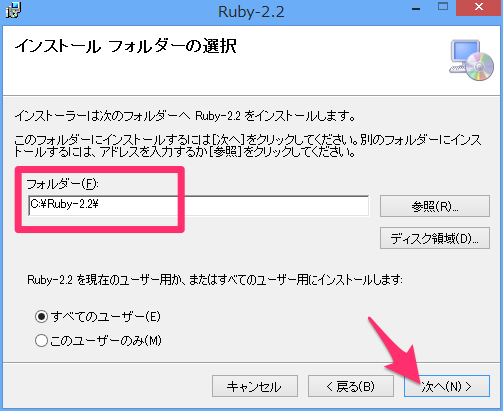
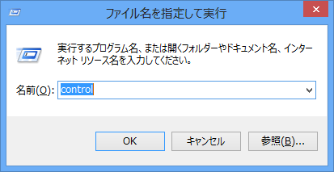
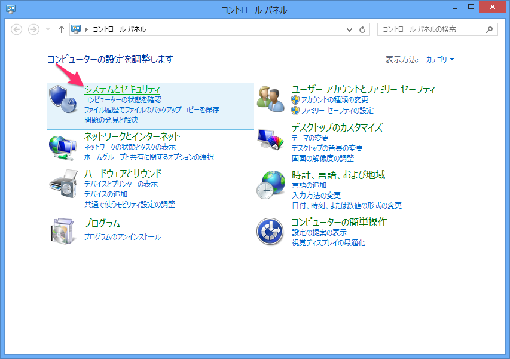
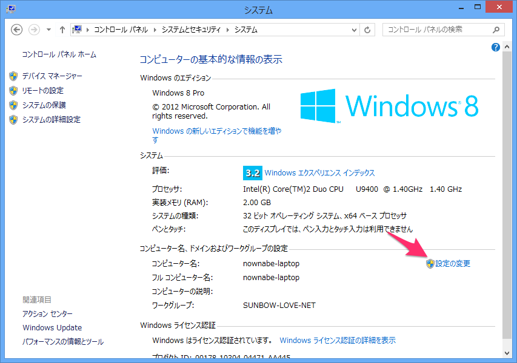
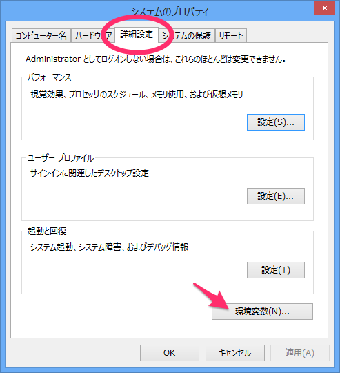
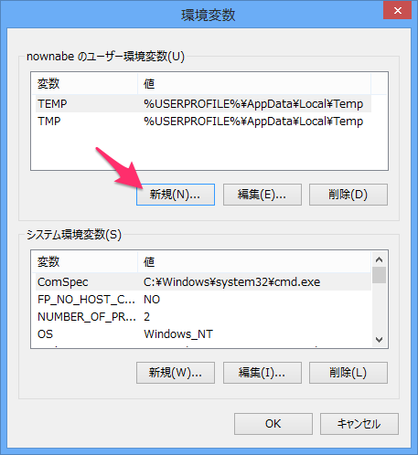
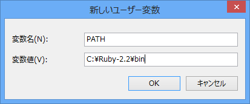
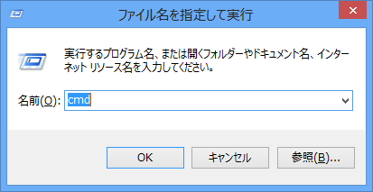
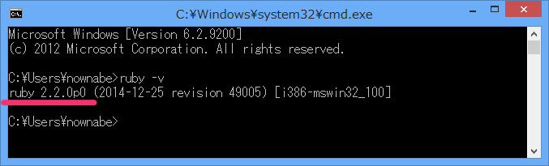
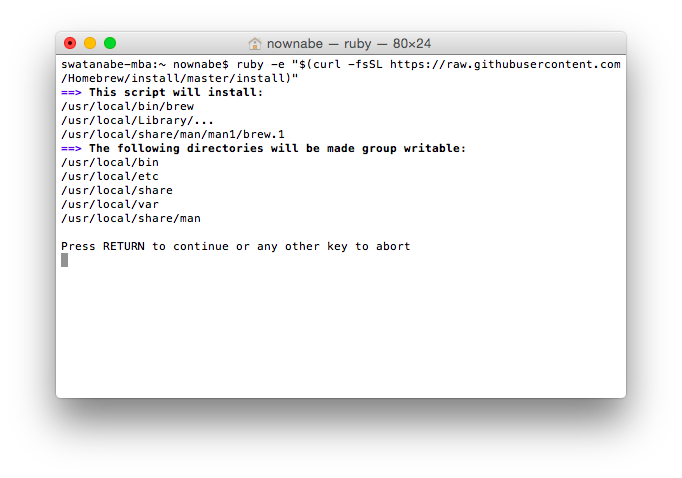

# 環境準備
## 概要
Rubyを動かすための準備をします。

Mac/LinuxとWindowsで手順が異なります。

## Windows
Windowsではインストーラーを使ってRubyをインストールします。
次のURLからインストーラーをダウンロードしてください。

[http://www.artonx.org/data/asr/Ruby-2.2.msi](http://www.artonx.org/data/asr/Ruby-2.2.msi)

ダウンロードできたらインストーラーを起動してインストールしてください。
インストールの途中の「インストールフォルダー」ではフォルダーを「`C:\Ruby-2.2\`」と入力してください。



インストールが完了したらPATHの設定を行います。
コマンドプロンプトからRubyを使うために必要です。

【Widndowsキー + R】で「ファイル名を指定して実行」ダイアログを出して「`control`」と入力して【OK】ボタンをクリックしてください。



「システムとセキュリティ」をクリックしてください。



「システム」をクリックしてください。


「設定の変更」をクリックしてください。



「システムのプロパティ」という画面が表示されるので、「詳細設定」タブの【環境変数(N)...】ボタンをクリックしてください。



また新しい画面が表示されます。【新規(N)...】をクリックしてください。すでに`PATH`という変数がある場合は`PATH`を選択して【編集】ボタンをクリックしてください。



変数名に「`PATH`」、変数値に「`C:\Ruby-2.2\bin`」と入力してください。
既に`PATH`があった場合は変数値の末尾に`;`(セミコロン)で区切って追加してください。



【OK】ボタンを連打して設定画面を閉じてください。
次に、【Windowsキー + R】で「`cmd`」と入力してコマンドプロンプトを起動してください。



次のコマンドを実行して、Rubyのバージョンが表示されれば成功です！



### MacでRubyインストール
Macでインストールする手順は少し複雑です。次の流れでインストールしていきます。

* Homebrewインストール
* 必要パッケージインストール
* anyenvインストール
* rbenvインストール
* Ruby 2.2インストール

まずはHomebrewをインストールします。
ターミナルを開いて次のコマンドを実行してください。
途中でEnterキーやパスワードを入力する必要があります。

```bash
ruby -e "$(curl -fsSL https://raw.githubusercontent.com/Homebrew/install/master/install)"
```



次のコマンドでバージョンが表示されれば成功です。

```bash
brew -v
```

次にHomebrewを使ってRubyのインストールに必要なソフトをインストールします。
次のコマンドを実行してください。

```bash
brew install openssl libyaml libffi readline
```

次にanyenvをインストールします。
次の一連のコマンドを順に実行してください。(1行1コマンド)

```bash
git clone https://github.com/riywo/anyenv ~/.anyenv
echo 'export PATH="$HOME/.anyenv/bin:$PATH"' >> ~/.bash_profile
echo 'eval "$(anyenv init -)"' >> ~/.bash_profile
mkdir ~/.anyenv/plugins
git clone https://github.com/znz/anyenv-update.git ~/.anyenv/plugins/anyenv-update
exec $SHELL -l
```

次にrbenvをインストールします。
次のふたつのコマンドを実行してください。

```bash
anyenv install rbenv
exec $SHELL -l
```

最後にRubyをインストールします。
次のコマンドを実行してください。

```bash
rbenv install 2.2.3
rbenv global 2.2.3
```

次のコマンドでRubyのバージョンが表示されれば成功です！

```bash
ruby -v
```