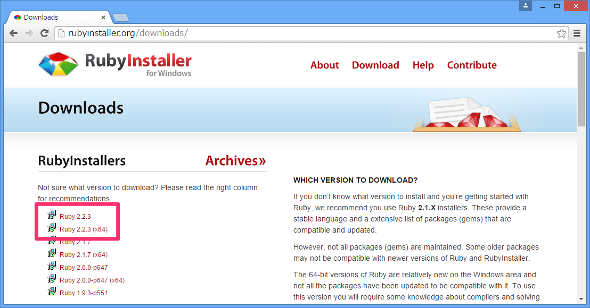
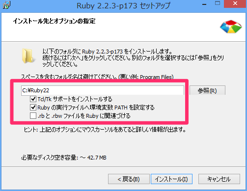
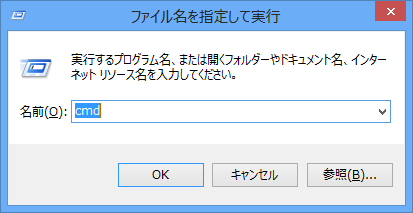
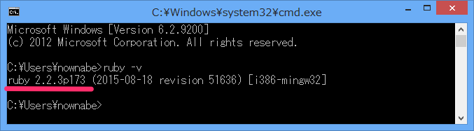

# 環境準備
## 概要
Rubyを動かすための準備をします。

Windows/MacOS/CentOSの手順をそれぞれ紹介します。

## Windows
Windowsでは[RubyInstaller](http://rubyinstaller.org/)を使ってインストールします。

次のURLにアクセスして、2.2.xをダウンロードしてください。
(64bit OSの方はx64の方をダウンロードしてください)

http://rubyinstaller.org/downloads/



ダウンロードできたら起動してください。
最初にインストーラーの表示言語を選ぶ画面が出てくるので好きな言語を選択してください。

いくつか進めると次のような設定画面になります。
「Td/Tkサポートをインストールする」と「Rubyの実行ファイルへ環境変数PATHを設定する」にチェックを入れてください。
フォルダ名はデフォルトの「`C:\Ruby22`」でOKです。



設定できたら【インストール】ボタンをクリックして、完了したら【完了】ボタンをクリックして終了してください。

次に、【Windowsキー + R】で「cmd」と入力してコマンドプロンプトを起動してください。



`ruby -v`というコマンドを実行して、Rubyのバージョンが表示されれば成功です！



### MacでRubyインストール
Macでインストールする手順は少し複雑です。次の流れでインストールしていきます。

* Homebrewインストール
* 必要パッケージインストール
* anyenvインストール
* rbenvインストール
* Ruby 2.2インストール

まずはHomebrewをインストールします。
ターミナルを開いて次のコマンドを実行してください。
途中でEnterキーやパスワードを入力する必要があります。

```bash
ruby -e "$(curl -fsSL https://raw.githubusercontent.com/Homebrew/install/master/install)"
```


次のコマンドでバージョンが表示されれば成功です。

```bash
brew -v
```

次にHomebrewを使ってRubyのインストールに必要なソフトをインストールします。
次のコマンドを実行してください。

```bash
brew install openssl libyaml libffi readline
```

次にanyenvをインストールします。
次の一連のコマンドを順に実行してください。(1行1コマンド)

```bash
git clone https://github.com/riywo/anyenv ~/.anyenv
echo 'export PATH="$HOME/.anyenv/bin:$PATH"' >> ~/.bash_profile
echo 'eval "$(anyenv init -)"' >> ~/.bash_profile
mkdir ~/.anyenv/plugins
git clone https://github.com/znz/anyenv-update.git ~/.anyenv/plugins/anyenv-update
exec $SHELL -l
```

次にrbenvをインストールします。
次のふたつのコマンドを実行してください。

```bash
anyenv install rbenv
exec $SHELL -l
```

最後にRubyをインストールします。
次のコマンドを実行してください。

```bash
rbenv install 2.2.3
rbenv global 2.2.3
```

次のコマンドでRubyのバージョンが表示されれば成功です！

```bash
ruby -v
```

## CentOS
まずはRubyのインストールに必要なパッケージをインストールします。

```bash
sudo yum install epel-release
sudo yum install -y git gcc openssl-devel libyaml-devel libffi-devel readline-devel zlib-devel gdbm-devel ncurses-devel
```

次にanyenvをインストールします。
次の一連のコマンドを順に実行してください。(1行1コマンド)

```bash
git clone https://github.com/riywo/anyenv ~/.anyenv
echo 'export PATH="$HOME/.anyenv/bin:$PATH"' >> ~/.bash_profile
echo 'eval "$(anyenv init -)"' >> ~/.bash_profile
mkdir ~/.anyenv/plugins
git clone https://github.com/znz/anyenv-update.git ~/.anyenv/plugins/anyenv-update
exec $SHELL -l
```

次にrbenvをインストールします。
次のふたつのコマンドを実行してください。

```bash
anyenv install rbenv
exec $SHELL -l
```

最後にRubyをインストールします。
次のコマンドを実行してください。

```bash
rbenv install 2.2.3
rbenv global 2.2.3
```

次のコマンドでRubyのバージョンが表示されれば成功です！

```bash
ruby -v
```
