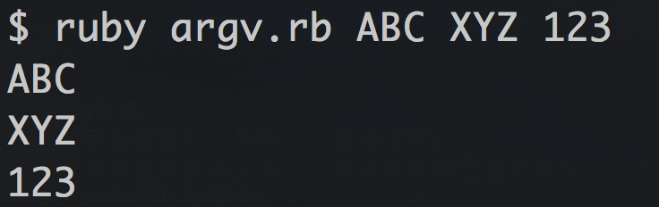

# 演習問題
## 概要
演習問題をいくつか用意しました。
各問題の冒頭にある番号はこのテキストの章番号を表しており、その章を読み終わったら順番に解けるようになっています。

また、`*`がついた問題は少し難易度の高い応用問題となっています。
それ以外は基礎的な問題なので必ず解くようにしましょう。

## (1) ファイルを表示する
__(2.4 オブジェクト)__

Linuxのcatコマンドのようにファイルの内容をそのまま出力する`cat.rb`というプログラムを作成してください。
表示するファイル名は`sample1.txt`としてください。

`sample1.txt`は次のURLからダウンロードして、プログラムと同じディレクトリに保存してください。
https://raw.githubusercontent.com/nownabe/webapp_tutorial/master/ruby/sample1.txt

Mac/Linuxであれば次のコマンドでダウンロードできます。

```bash
curl --output ~/lestudy/ruby/sample1.txt https://raw.githubusercontent.com/nownabe/webapp_tutorial/master/ruby/sample1.txt
```

Rubyでファイルを読み込むには次のようにします。

```ruby
File.read("sample1.txt")
```

`File.read("ファイル名")`でファイルの内容を文字列として読み込むことができるので、そのまま`puts`や`print`で出力することができます。


## (2) コマンドライン引数
__(2.4 オブジェクト)__

コマンドライン引数を3つ受け取って、そのまま出力する`argv.rb`というプログラムを作成してください。

Rubyではコマンドラインからの引数を受取ることができます。
例えばRubyプログラムを実行するときに

```bash
ruby my_program.rb ABC
```

とプログラムのファイル名の後ろに文字列をつけると、プログラムの中でその文字列を使うことができます。
この例だと`ABC`という文字列をプログラム内で使用することができます。

また、スペース区切りで複数の文字列を使うこともできます。

```bash
ruby my_program.rb ABC XYZ
```

このような文字列のことを、コマンドライン引数といいます。

Rubyのプログラム内でコマンドライン引数を使うには`ARGV`というものを使います。
例えば上の例だと、`ARGV[0]`は`"ABC"`を意味します。
`ARGV[1]`は`"XYZ"`を意味します。
数字を増やせばもっと引数を受取ることができますが、数字は0から始まることに注意してください。

以上を踏まえ、`argv.rb`を実行するとこんな感じになるようにしてください。



## (3) コマンドラインでファイル名を受け取ってその内容を表示する
__(2.4 オブジェクト)__

(1)で作成した`cat.rb`を修正して、コマンドラインで指定したファイルの内容を表示するようにしてください。
プログラムは`cat2.rb`としてください。


## (4) ユーザー入力の取得
__(2.6 変数)__

ユーザー(プログラムを実行する人)の名前を聞いて、その名前に対して「こんにちは、○○さん」と挨拶するプログラム`hello_user.rb`を作成してください。
また、プログラム中で必ず変数を使用してください。

```bash
$ ruby hello_user.rb
お名前を教えて下さい > nownabe
こんにちは、nownabeさん
```

プログラムの外部から動的に情報を受取るには、コマンドライン引数以外にもあります。
そのひとつが、プログラム実行中にユーザーに入力してもらう方法です。

`gets`というメソッドを使えば、ユーザーが入力する1行を受取ることができます。

```irb
irb(main):001:0> gets
ユーザー入力
=> "ユーザー入力\n"
irb(main):002:0>
```


`gets`で受け取った文字列には改行が入っています。
末尾の改行を取り除くには`chomp`メソッドを使ってください。

```irb
irb(main):001:0> name = gets
nownabe
=> "nownabe\n"
irb(main):002:0> name.chomp
=> "nownabe"
```

## (5) ファイル連結
__(2.6 変数)__

コマンドライン引数で2つのファイル名を指定するとその2つのファイルの内容を連結して表示するプログラム`concat_files.rb`を作成してください。

実行例:

```bash
$ head sample1.txt > short_sample1.txt  #(短いsample1.txtを作る)
$ ruby concat_files.rb short_sample1.txt short_sample1.txt 
# はじめてのRuby
## 概要
Rubyのプログラムを作って実行してみます。

## プログラムとは
プログラムとは「コンピュータへの命令」を記述したものです。
別の言い方をすると「コンピュータに何をして欲しいか」が書いてあるものです。

例えばスマホには必ずついてるアラームのプログラムなら「設定した時間にアラームを鳴らして欲しい」と書いてあります。
音楽プレイヤーには「指定した音楽ファイルをスピーカーから流して欲しい」と書いてあります。
# はじめてのRuby
## 概要
Rubyのプログラムを作って実行してみます。

## プログラムとは
プログラムとは「コンピュータへの命令」を記述したものです。
別の言い方をすると「コンピュータに何をして欲しいか」が書いてあるものです。

例えばスマホには必ずついてるアラームのプログラムなら「設定した時間にアラームを鳴らして欲しい」と書いてあります。
音楽プレイヤーには「指定した音楽ファイルをスピーカーから流して欲しい」と書いてあります。
```

## (6) ファイル連結2
__(2.7 メソッド)__

(5)で作成した`concat_files.rb`を次のようにして書き換えた(同じ動作をする)`concat_files2.rb`を作成してください。

* ファイル名を引数として受取りそのファイルの内容を出力するメソッド`print_file`を作る
* そのメソッドにコマンドライン引数を渡す

## (7) ヒアドキュメント
__(2.8 条件分岐)__

2.8 条件分岐の練習問題(3)で作成したHello, world!のプログラムをヒアドキュメントで書きなおしてください。

ヒアドキュメントとは複数行に渡る文字列を簡潔に書くための方法です。

```irb
irb(main):001:0> <<EOS
irb(main):002:0" これはヒアドキュメントです。
irb(main):003:0" 複数行に渡る文字列を
irb(main):004:0" こ〜〜〜〜〜〜
irb(main):005:0"        んな感じで書くことが
irb(main):006:0" できます！！
irb(main):007:0" EOS
=> "これはヒアドキュメントです。\n複数行に渡る文字列を\nこ〜〜〜〜〜〜\n       んな感じで書くことが\nできます！！\n"
```

EOSはヒアドキュメントの終わりを示すキーワードで、EOSでなくてもOKです。

ヒアドキュメントは次のように変数に代入したりそのまま出力することもできます。

```ruby
string = <<DOC
ここはヒアドキュメント。
変数に代入することもできます。

ヒアドキュメントの終わりを示すキーワードはEOSじゃなくてなんでもOKです。
小文字でも大丈夫ですが、わかりやすいように大文字にすることが多いです。
EOSはEnd Of Stringの略です。
DOC

puts string

puts "========"

puts <<HTML
<h1>ヒアドキュメント</h1>

<p>ヒアドキュメントはこのように、直接出力することもできます。</p>
<p>少しわかりにくいかもしれませんが、複数行に渡る長い文字列を扱うときには非常に便利です。</p>
HTML
```

このプログラムを実行すると次のようになります。

```bash
$ ruby heredocument.rb
ここはヒアドキュメント。
変数に代入することもできます。

ヒアドキュメントの終わりを示すキーワードはEOSじゃなくてなんでもOKです。
小文字でも大丈夫ですが、わかりやすいように大文字にすることが多いです。
EOSはEnd Of Stringの略です。
========
<h1>ヒアドキュメント</h1>

<p>ヒアドキュメントはこのように、直接出力することもできます。</p>
<p>少しわかりにくいかもしれませんが、複数行に渡る長い文字列を扱うときには非常に便利です。</p>
```

参考:

* [ヒアドキュメント](http://docs.ruby-lang.org/ja/2.2.0/doc/spec=2fliteral.html#here)

## (8) ファイル表示++
__(2.8 条件分岐)__

(3)で作成したプログラム基に、次のように改善したプログラムを新しく作成してください。

* ファイルが存在したらファイルの内容を出力する
* ファイルが存在しなかったら「ファイルが存在しません」と出力する

ファイルが存在するかどうかは、次のように確認することができます。

```irb
irb(main):001:0> File.exist?("sample1.txt")
=> true
irb(main):002:0> File.exist?("sample2.txt")
=> false
```

参考:

* [File.exist?](http://docs.ruby-lang.org/ja/2.2.0/class/File.html#S_EXIST--3F)

## (9) 行数表示
__(2.10 繰り返し)__

(8)で作成したプログラムを基に、次のように修正したプログラムを新しく作成してください。

* 各行の先頭に行数を挿入する

このプログラムを実行すると次のようになります。

```bash
$ ruby numbered_cat.rb sample1.txt
0: # はじめてのRuby
1: ## 概要
2: Rubyのプログラムを作って実行してみます。
3:
4: ## プログラムとは
5: プログラムとは「コンピュータへの命令」を記述したものです。
6: 別の言い方をすると「コンピュータに何をして欲しいか」が書いてあるものです。
7:
8: 例えばスマホには必ずついてるアラームのプログラムなら「設定した時間にアラームを鳴らして欲しい」と書いてあります。
9: 音楽プレイヤーには「指定した音楽ファイルをスピーカーから流して欲しい」と書いてあります。
10:
11: ## プログラミングとは
12: プログラムを作ることです。
13: 言い換えると、「コンピュータにしてほしいことをコンピュータに__正確に__伝える」作業になります。
14: だいたい人間が行います。
15:
16: ## Rubyとは
17: プログラムを書くための人工言語です。
18: 人間がコミュニケーションを取るための言語ではなく、人間がコンピュータへの命令を書くために作られた言語です。
19:
20: また、Rubyは「楽しくプログラミングする」ということを目的に作られています。
21:
22: ## Rubyでのプログラミング
23: Rubyでのプログラミングは次のような流れになります。
24:
25: 1. テキストエディタでRubyプログラムを書く
26: 2. プログラムをファイルに保存する
27: 3. 保存したプログラムを実行する
28:
29: この章ではこの流れを一通りやってみます。
```

文字列(ファイルの内容)を行ごとに処理するには、次のようにします。

```ruby
file_content.lines.each do |line|
  各行ごとの処理
end
```

`文字列.lines`で行の配列が返ります。そして、その配列に`each`で繰り返し処理をしています。

参考:

* [String#lines](http://docs.ruby-lang.org/ja/2.2.0/class/String.html#I_LINES)
* [Array#each](http://docs.ruby-lang.org/ja/2.2.0/class/Array.html#I_EACH)
* [Array#each_with_index](http://docs.ruby-lang.org/ja/2.2.0/class/Enumerable.html#I_EACH_WITH_INDEX)

## (10) ヘッダの抽出
__(2.10 繰り返し)__

(8)で作成したプログラムを基に、次のように修正したプログラムを新しく作成してください。

* ヘッダ行(`#`を含む行)だけを表示する

このプログラムを実行すると次のようになります。

```bash
$ ruby extract_headers.rb sample1.txt
# はじめてのRuby
## 概要
## プログラムとは
## プログラミングとは
## Rubyとは
## Rubyでのプログラミング
```

ある文字列にある文字が含まれるかどうかを調べるには、`include?`メソッドを使います。

```irb
irb(main):001:0> "Hello, world!".include?("H")
=> true
irb(main):002:0> "Hello, world!".include?("A")
=> false
```

参考:
* [String#include?](http://docs.ruby-lang.org/ja/2.2.0/class/String.html#I_INCLUDE--3F)

## (11) 作成中。。。