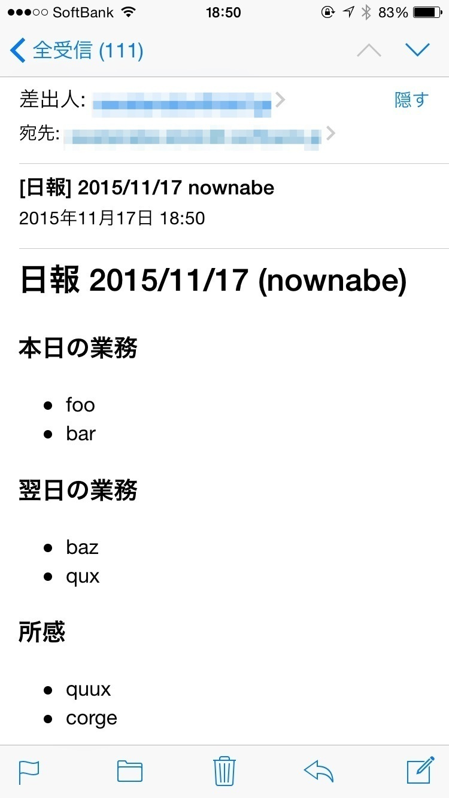

# おまけ: Gmail with Ruby
## 概要
RubyからGmailを使っていい感じの日報メールを送信するプログラムを作ってみます。
下のようなメールをRubyのプログラムから送信することが目標です。



このフォーマットはあくまでも例で、HTMLで好きなようにカスタマイズできるようになっています。
また、項目や表示の仕方はあくまでサンプルでしかないので自分で使いやすいようにカスタマイズして使ってみてください。

今回はRubyでコンソールからの送信になりますが、最終的にはWebアプリでメールを送信できるようにします。

## 流れ
日報メールプログラムは、次の流れで実行されます。

1. ユーザに「本日の業務」を入力してもらう
  * 「本日の業務」を複数入力してもらってそれを配列に格納します
2. ユーザに「翌日の業務」を入力してもらう
3. ユーザに「所感」を入力してもらう
4. 間違った日報を送信しないように入力内容を確認する
  * 入力内容を出力してユーザにy(yes)/n(no)を入力してもらいます
5. 入力内容からメール本文のHTMLを生成する
  * 綺麗なメールを送るため、メール本文をHTMLにします
6. メールを送信する
  * Gmailを使ってメールを送信します

これらの流れは次の機能に分割できます。

* 1, 2, 3: ユーザが入力した複数の項目を配列として格納する
* 4: yが入力されたら引き続き処理をして、nが入力されたらプログラムをそこで終了する
* 5: HTML文字列を作成する
* 6: Gmailでメールを送信する

これらの4つの機能をそれぞれ説明して、最後に組み合わせて日報メールプログラムを完成させます。

## 複数項目の入力
ユーザに複数項目を入力させてそれを配列に格納します。
今回の場合で言えば、最終的に次のような配列ができるイメージです。

```ruby
today_tasks = ["店内の清掃", "材料の仕入れ", "厨房での調理"]
```

これを「本日の業務」と「翌日の業務」と「所感」でそれぞれ実行します。

下のプログラムは「本日の業務」を入力させる例です。
何も入力せずEnterすると入力を終了します。
作成して実行してみてください。

```ruby
# 最初に空の配列で用意する
today_tasks = []
puts "本日の業務を入力してください。"
puts "何も入力せずEnterすると入力を終了します。"

# 複数項目入力できるようにloopで繰り返す
# 1回の繰り返しで1項目増える
loop do
  # ユーザの入力を受け付ける
  print "> "
  task = gets.chomp

  if task.empty?
    # もし何も入力がなければ終わりとみなしてloopから抜ける
    break
  else
    # 入力があれば、配列に項目を追加する
    today_tasks << task
  end
end

# pメソッドで確認する
p today_tasks
```

実行すると次のようになるはずです。

```bash
$ ruby input_items.rb
本日の業務を入力してください。
何も入力せずEnterすると入力を終了します。
> 店内の清掃
> 材料の仕入れ
> 厨房での調理
>
["店内の清掃", "材料の仕入れ", "厨房での調理"]
```

## プログラムを途中で中断する
今回作るプログラムは間違った内容の日報メールを送信しないように入力内容を確認して、

* OKなら引き続き処理を行ってメールを送信する
* NGならそこで処理を中断する

ということが必要になります。

途中でプログラムを中断するには、`exit`メソッドを使用します。
例えば次のプログラムを実行すると「さいしょ」しか出力されません。

```ruby
puts "さいしょ"
exit
puts "さいご"
```

これを今回使う様な形にするとこんな感じになります。

```ruby
print "この内容でメールを送信しますか？ [Y/n] "
answer = gets.chomp

if !(answer == "Y" || answer == "y" || answer.empty?)
  puts "処理を中断します。"
  exit
end

puts "メールを送信しました！"
```

毎回「y」と入力するのはめんどくさいので、空EnterでもYesとみなすようにしています。
この`if`文は、「ユーザの入力内容が"Y"か"y"か空、ではない場合」という条件になっています。

`[Y/n]`というのは、デフォルト(空Enter)でYesとみなしますよ、という表現です。

このプログラムを実行すると次のようになります。

```bash
$ ruby exit.rb
この内容でメールを送信しますか？ [Y/n]
メールを送信しました！
$ ruby exit.rb
この内容でメールを送信しますか？ [Y/n] y
メールを送信しました！
$ ruby exit.rb
この内容でメールを送信しますか？ [Y/n] n
処理を中断します。
```

## RubyでHTMLを生成する
メールを美しく表示させるため日報をHTMLメールとして送信します。
そのため、ユーザが入力した内容からHTMLを生成する必要があります。

といっても、難しく考えないでください。
単純にRubyの文字列オブジェクトにHTMLを書けばOKです。

例えば、HTMLの見出しを表現した文字列は次のようになります。

```ruby
html = "<h1>見出し！</h1>"
```

今回は、次のようなHTMLを作成してメールで送信します。
(メールで送信する場合、`<!DOCTYPE html>`や`html`タグ、`head`、`body`タグなどは不要です)

```html
<h2>日報 2015/11/11 nownabe</h2>

<h3>本日の業務</h3>
<ul>
  <li>店内の清掃</li>
  <li>材料の仕入れ</li>
  <li>厨房での調理</li>
</ul>

<h3>翌日の業務</h3>
<ul>
  <li>賞味期限切れ食材の廃棄</li>
  <li>厨房での調理</li>
<ul>

<h3>所感</h3>
<ul>
  <li>今日はいつもよりお客さんが多く、忙しかったです。</li>
  <li>なぜか大量に生姜が消費されています。寒いから？</li>
</ul>
```

最終的にひとつの文字列オブジェクトとしてこのHTMLを作成します。
次のように、1行ごとに`concat`メソッドで文字列を連結していくといいでしょう。

```ruby
today_tasks    = ["店内の清掃", "材料の仕入れ", "厨房での調理"]
tomorrow_tasks = ["賞味期限切れ食材の廃棄", "厨房での調理"]
impressions    = [
  "今日はいつもよりお客さんが多く、忙しかったです。",
  "なぜか大量に生姜が消費されています。寒いから？"
]

date = Time.now.strftime("%Y/%m/%d")

html = ""
html.concat "<h2>日報 #{date} nownabe</h2>"

html.concat "<h3>本日の業務</h3>"
html.concat "<ul>"
today_tasks.each do |task|
  html.concat "<li>#{task}</li>"
end
html.concat "</ul>"

html.concat "<h3>翌日の業務</h3>"
html.concat "<ul>"
tomorrow_tasks.each do |task|
  html.concat "<li>#{task}</li>"
end
html.concat "</ul>"

html.concat "<h3>所感</h3>"
html.concat "<ul>"
impressions.each do |impression|
  html.concat "<li>#{impression}</li>"
end
html.concat "</ul>"

puts html
```

`Time`クラスの`strftime`メソッドは、時刻から指定されたフォーマットの文字列を生成します。

```irb
>> Time.now.strftime("%Y/%m/%d")
=> "2015/11/20"
>> Time.now.strftime("%Y年%m月%d日")
=> "2015年11月20日"
```

## Gmailでメールを送信する
ではいよいよGmailを使ってメールを送信してみましょう！

### アプリパスワード取得
2段階認証を設定している方はまずプログラム専用のアプリパスワードというものが必要になります。
こちらのページにアクセスしてください。
https://security.google.com/settings/security/apppasswords

「端末を選択」のところで「その他 (名前を入力)」を選択して「Ruby(日報メール)」と入力してください。

次に【生成】ボタンをクリックするとパスワードが表示されるので、それをメモしておいてください。

### ruby-gmailインストール
Gmailを使うために、ruby-gmailというライブラリをインストールする必要があります。
これはRubyGemsというパッケージ形式で配布されていて、次のコマンドでインストールすることができます。

```bash
gem install ruby-gmail
```

### メールの送信方法
次のようなプログラムでメールを送信することができます。

```ruby
# ruby-gmailライブラリを読み込む
require "gmail"

# Gmailクラスのオブジェクトを作る
# (ログインする)
gmail = Gmail.new("Gmailのメールアドレス", "Gmailのパスワード")

# メールを書く
message = gmail.generate_message do
  to("宛先のメールアドレス")
  subject("メールのタイトル")
  html_part do
    content_type("text/html; charset=UTF-8")
    body("メールの本文(HTML)")
  end
end

# メールを送信する
gmail.deliver(message)

# ログアウトする
gmail.logout
```

### メールを送信してみる
では実際に次のプログラムを参考にして、メールを送信してみてください。
宛先にはとりあえず自分のメールアドレスを設定してください。

```ruby
# Gmailのログイン情報の設定
USERNAME = "自分のGmailのメールアドレス"
PASSWORD = "自分のGmailのパスワード" # 2段階認証の場合は取得したアプリパスワード

# 宛先のメールアドレス (複数指定可能)
TO = [
  "atesaki1@example.com",
  "atesaki2@example.com"
]

# ruby-gmailライブラリを読み込む
require "gmail"

# Gmailクラスのインスタンスを作る
gmail = Gmail.new(USERNAME, PASSWORD)

# メールを書く
message = gmail.generate_message do
  to(TO)
  subject("Rubyからのメール！！")
  html_part do
    content_type("text/html; charset=UTF-8")
    body("<h3>届いてる〜〜?</h3>")
  end
end

# メールを送信する
gmail.deliver(message)

# ログアウトする
gmail.logout
```

`USERNAME`などの全て大文字の変数は、__定数__と呼ばれる特別な変数です。
プログラム中で再代入することができないので、プログラムの設定に使ったりします。
(厳密にいうと再代入もできます)

## 日報メールプログラムの作成
これまでに説明した4つの機能を組み合わせて、日報メールを送信するプログラムを作成してください。

もう一度、プログラム全体の流れをおさらいしておきましょう。

1. ユーザに「本日の業務」を複数個入力してもらい`today_tasks`配列に格納する
2. ユーザに「翌日の業務」を複数個入力してもらい`tomorrow_tasks`配列に格納する
3. ユーザに「所感」を複数個入力してもらい`impressions`配列に格納する
4. 間違った日報を送信しないように入力内容を表示する
5. ユーザに`y`か`n`を入力してもらい、`n`なら処理を中断する
5. 3つの配列や今日の日付からメール本文HTMLの文字列を作る
6. メールを送信する

最後に日報プログラムのサンプルがあるので、わからなくなったら参考にしてみてください。

## 全ソースコード
日報メールプログラムを実現するソースコードです。
ユーザの入力や配列の出力をメソッドにまとめていたりします。

```ruby
require "gmail"

# 設定
USERNAME = "Gmailのメールアドレス"
PASSWORD = "アプリパスワード"
MYNAME   = "名前"
TO = ["宛先1", "宛先2"]

# メソッド定義
def get_list(list_name)
  puts "#{list_name}を入力してください。"
  puts "何も入力せずEnterすると次へ進みます。"

  list = []
  loop do
    print "> "
    task = gets.chomp
    if task.empty?
      break
    else
      list.push(task)
    end
  end
  list
end

def print_list(list)
  list.each { |element| puts "- #{element}" }
end

### ここからプログラム開始 ###

# ユーザの入力
## 本日の業務
today_tasks = get_list("本日の業務")
puts # 空行出力

## 翌日の業務
tomorrow_tasks = get_list("翌日の業務")
puts

## 所感
impressions = get_list("所感")
puts

# 確認
puts "以下の内容でメールを送信します。"
puts "================"
puts "# 本日の業務"
print_list(today_tasks)
puts
puts "# 翌日の業務"
print_list(tomorrow_tasks)
puts
puts "# 所感"
print_list(impressions)
puts "================"
print "よろしいですか？[Y/n] "
confirm = gets.chomp

## Yes (y or Y or 空Enter) 以外ならプログラムを終了する
if !(confirm == "y" || confirm == "Y" || confirm.empty?)
  puts "処理を中断します。"
  exit 1
end

# 本文HTML生成
date = Time.now.strftime("%Y/%m/%d")
html = "<h2>日報 #{date} (#{MYNAME})</h2>"

## 本日の業務
html.concat "<h3>本日の業務</h3>"
html.concat "<ul>"
today_tasks.each do |task|
  html.concat "<li>#{task}</li>"
end
html.concat "</ul>"

## 翌日の業務
html.concat "<h3>翌日の業務</h3>"
html.concat "<ul>"
tomorrow_tasks.each do |task|
  html.concat "<li>#{task}</li>"
end
html.concat "</ul>"

## 所感
html.concat "<h3>所感</h3>"
html.concat "<ul>"
impressions.each do |impression|
  html.concat "<li>#{impression}</li>"
end
html.concat "</ul>"

# メール送信
gmail = Gmail.new(USERNAME, PASSWORD)

message = gmail.generate_message do
  to(TO)
  subject("[日報] #{date} #{MYNAME}")
  html_part do
    content_type("text/html; charset=UTF-8")
    body(html)
  end
end

gmail.deliver(message)
gmail.logout
```