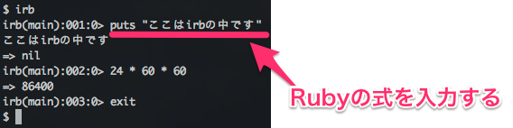

# irb
## 概要
Rubyのもう1つの実行方法である`irb`コマンドの使い方を覚えます。

## irbとは
前節でRubyのプログラムは`ruby`コマンドを使って実行すると説明しましたが、`irb`というコマンドを使って実行することもできます。
irbはInteractive Rubyの略で、対話的にRubyプログラムを実行することができます。


対話的にというとわかりにくいですが、この図のようにirbの中でプログラムを書くとすぐにその結果を得ることができます。
`.rb`ファイルを作る必要がありません。

手軽にRubyを実行するときによく使う方法です。

## はじめてのirb
それではirbを使ってみましょう。

`irb`コマンドを実行してください。

```bash
irb
```

すると、次のようなirbのプロンプトが現れます。

```irb
irb(main):001:0>
```

ここにRubyのプログラムを入力してエンターキーを押すとプログラムが即時実行されます。
適当に`puts`命令などを実行してみてください。



irbプロンプトは`exit`と入力すると抜けることができます。

## 式と結果
irbに入力したようなひとつひとつの短いRubyプログラムを「式」といいます。
Rubyのプログラムは複数の式が組み合わさってできています。

式は必ず「評価値」と呼ばれる結果を返します。
irbで`=>`の右側に表示されているのが入力した式の実行結果です。


## 練習問題
### (1) simple prompt
`irb`コマンドを実行する時、次のように`--simple-prompt`オプションを付けて実行してください。
普通に`irb`コマンドを実行するときとの違いを確かめてください。

```bash
irb --simple-prompt
```

### (2) printとputs
`irb`で`puts`命令と`print`命令をそれぞれ実行して、違いを確かめてください。
なぜそうなるかも考えてください。


### (3) 四則演算
Rubyでは電卓のような四則演算もできます。
演算子にはそれぞれ次の文字を使います。

* 足し算: `+`
* 引き算: `-`
* 掛け算: `*`
* 割り算: `/`

irbでそれぞれの演算子を使って計算してみてください。

割り算に違和感を覚えた方は、`%`という演算子も使ってみてください。