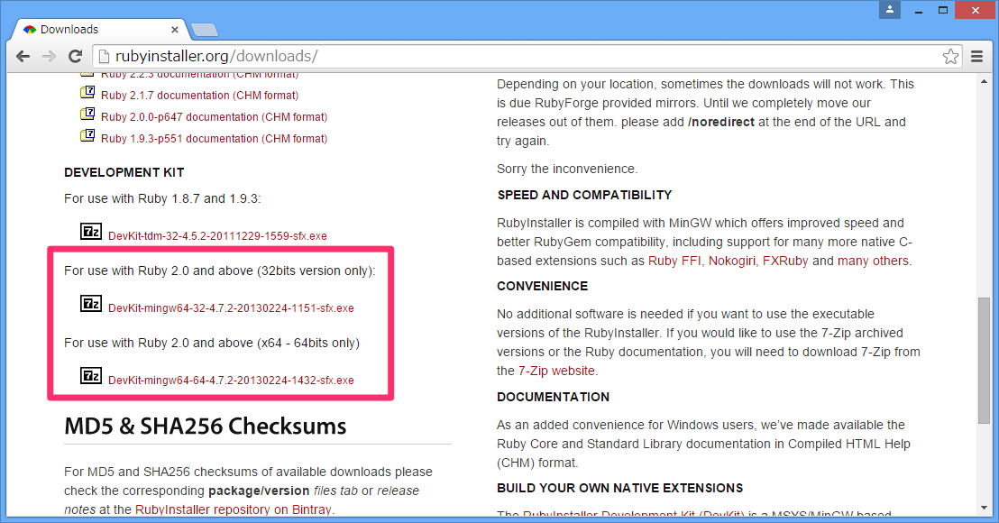
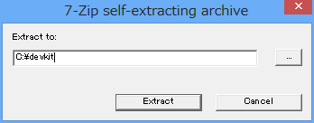
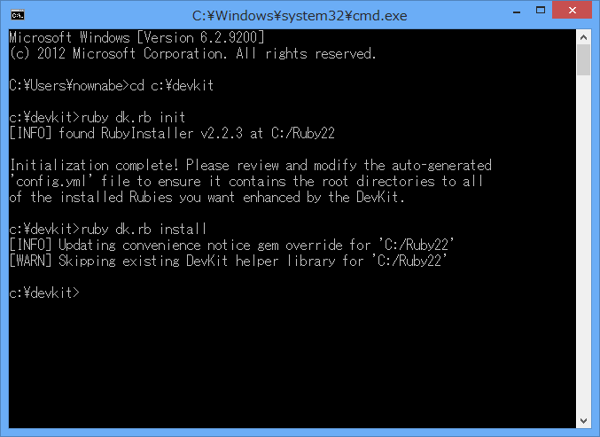
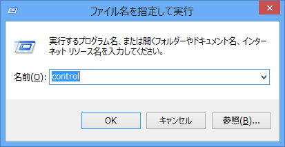
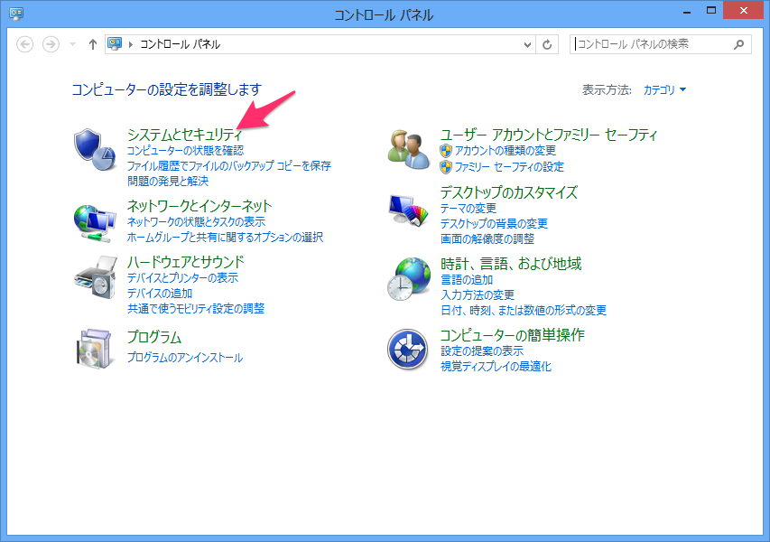
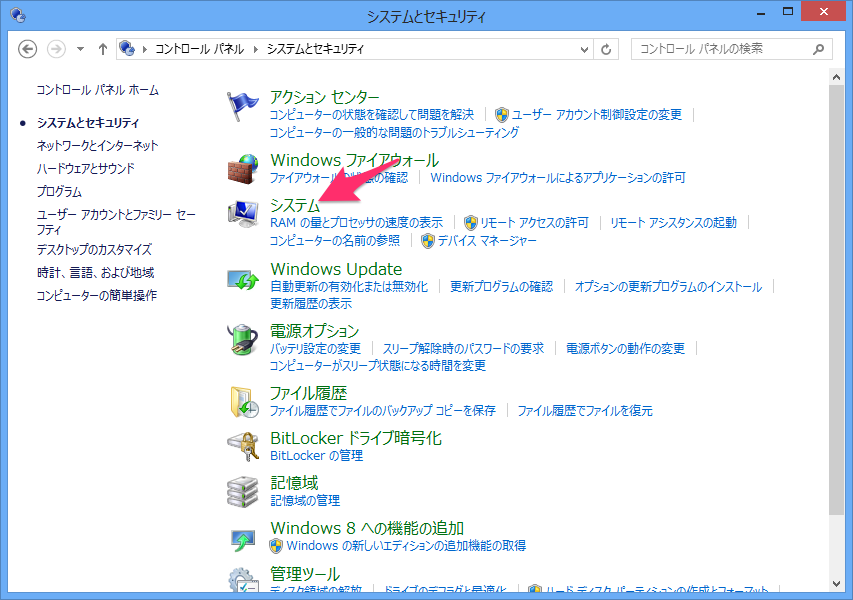
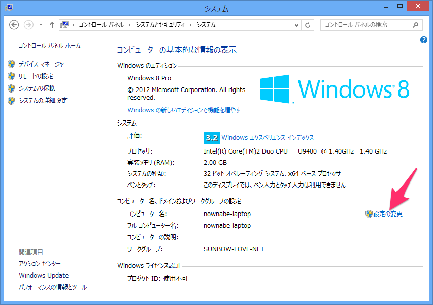
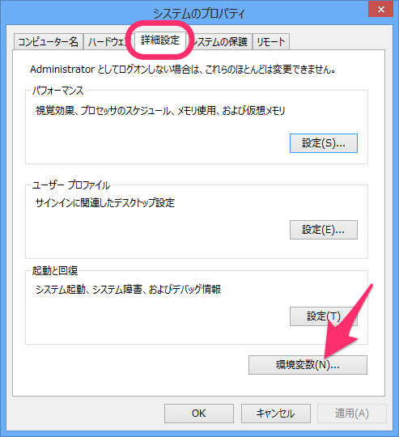
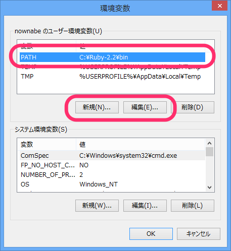
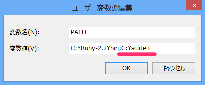

# 環境準備
## 概要
手軽に使える関係データベース管理システムであるSQLiteをインストールします。
Windows/MacOS/CentOSの手順をそれぞれ紹介します。

## Windows
### DevKitのインストール
まずDevKitというものをインストールする必要があります。
[ダウンロードページ](http://rubyinstaller.org/downloads)にアクセスしてください。
「DEVELOPMENT KIT」の下の「For use with Ruby 2.0 and above」のうち、32-bitか64-bitの自分のPCにあうものをダウンロードしてください。



ダウンロードできたらファイルを開いてください。
次のような画面が表示されるので、【Extract】をクリックしてください。



次はコマンドプロンプトを起動して、次の3つのコマンドを実行してください。

```bash
cd c:\devkit
ruby dk.rb init
ruby dk.rb install
```



多少表示は異なると思いますが、明らかにERRORのようなものが表示されていなければ成功です。

### SQLiteのインストール
最後にSQLiteをインストールします。
`c:\sqlite3`というフォルダを作って、そこにPATHを通し、いくつかのファイルを置きます。

まずは`c:\sqlite3`フォルダを作成してください。
作成できたらPATHの設定を行います。

まず【Windowsキー + R】で「control」と入力し、コントロールパネルを開いてください。



「システムとセキュリティ」をクリックしてください。



「システム」をクリックしてください。



「設定の変更」をクリックしてください。



【詳細設定】タブの【環境変数】ボタンをクリックしてください。



「ユーザーの環境変数」に「`PATH`」がある場合は【編集】ボタンを、ない場合は【新規】ボタンをクリックしてください。



「変数名」には「`PATH`」を、変数値には「`C:\sqlite3`」を入力してください。
変数値に既に値がある場合は、セミコロン(`;`)で区切って追加してください。



以上でPATHの設定は完了です。

SQLiteの[ダウンロードページ](http://www.sqlite.org/download.html)にアクセスして「Precompiled Binaries for Windows」の中からDLLをダウンロードして下さい。
(32-bitか64-bitは自分のPCにあう方を選んでください)


### コマンドラインプログラムのインストール
SQLiteの[ダウンロードページ](http://www.sqlite.org/download.html)にアクセスして「Precompiled Binaries for Windows」の中から「sqlite-shell-win32-x86-****.zip」をダウンロードしてください。


## Mac
Macは最初からSQLiteがインストールされているので、インストール不要です。

`sqlite3`というコマンドを実行するとSQLiteのコンソールに入れます。
抜けるときは`.quit`と入力してエンターキーを押してください。

```bash
$ sqlite3
SQLite version 3.8.4.3 2014-04-03 16:53:12
Enter ".help" for usage hints.
Connected to a transient in-memory database.
Use ".open FILENAME" to reopen on a persistent database.
sqlite> .quit
$ 
```

もし入っていない場合や最新のSQLiteが使いたい場合はHomebrewでインストールできます。

```bash
brew install sqlite
```

Homebrewがインストールできていない場合は[2.1 環境準備](https://nownabe.gitbooks.io/webapp_tutorial/content/ruby/environments.html)をみながらインストールしてください。


## CentOS
yumでインストールできます。
次のコマンドを実行してください。

```bash
sudo yum install -y sqlite sqlite-devel
```

インストールできたら、`sqlite3`コマンドでSQLiteのコンソールに入れます。
抜けるときは`.quit`と入力してエンターキーを押してください。

```bash
$ sqlite3
SQLite version 3.7.17 2013-05-20 00:56:22
Enter ".help" for instructions
Enter SQL statements terminated with a ";"
sqlite> .quit
$ 
```